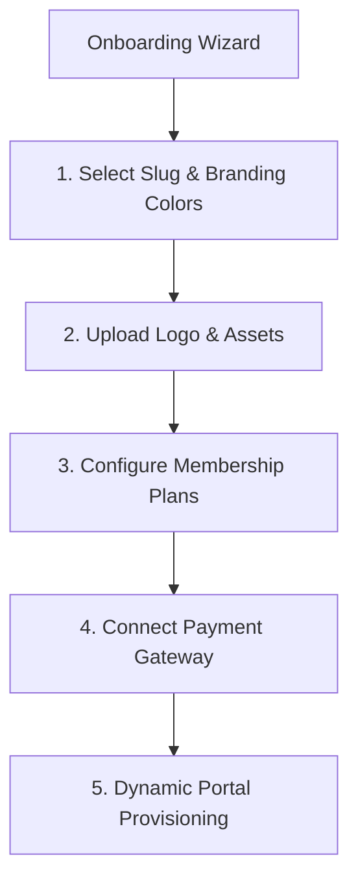
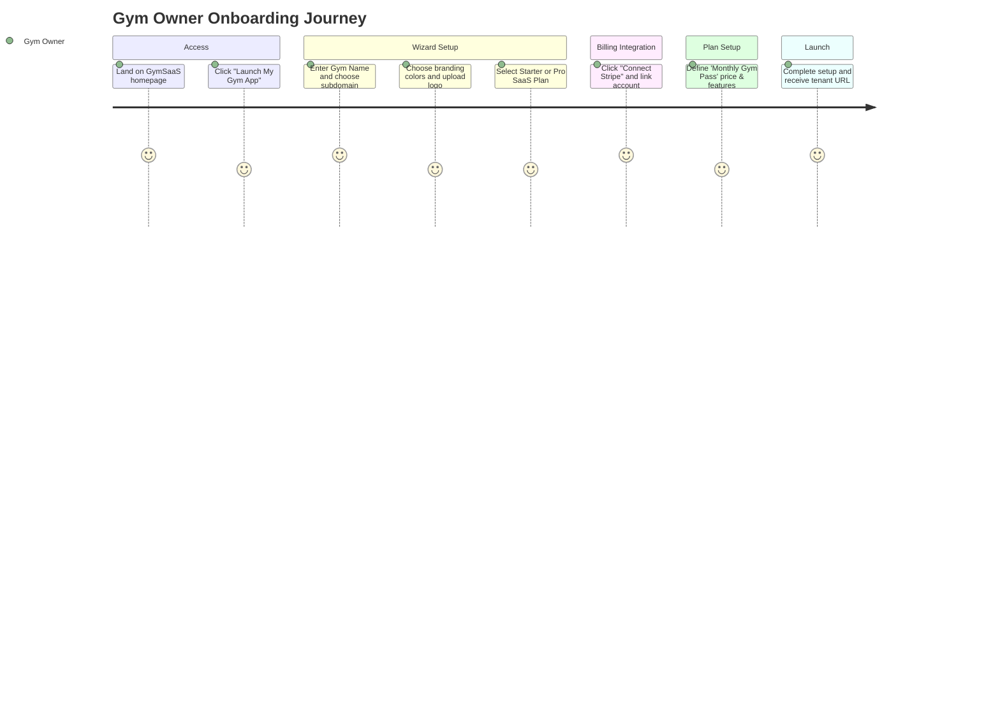
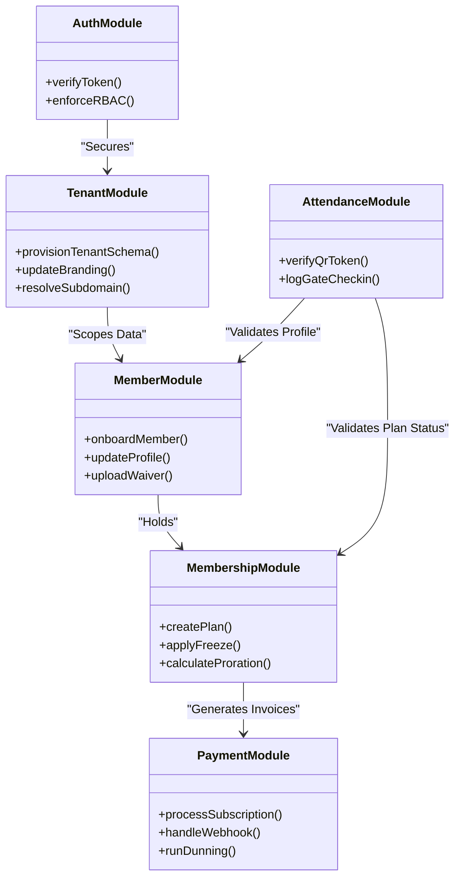
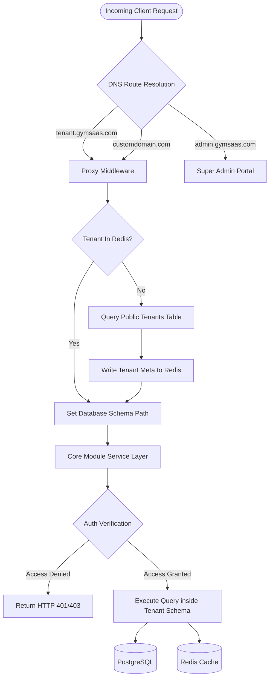

# 01. Product Requirements Document (PRD) & Specifications

This document defines the product vision, requirements, user profiles, journeys, and structural boundaries for the white-label, multi-tenant Gym Operating System.

---

## 1. Product Requirements Document (PRD)

### I. Vision Statement
To build a production-grade, white-label, multi-tenant Gym Operating System that allows any gym owner to launch their own branded management software and member PWA in less than 15 minutes, with zero coding or technical assistance required.

### II. Core Product Strategy & Features
To support the target 15-minute setup, the platform provides a self-service onboarding wizard and automated configurations.

- **No-Code Onboarding Wizard**: A step-by-step onboarding walkthrough for new Gym Owners:
  - Domain / Subdomain assignment (e.g. `[slug].gymsaas.com`).
  - Brand identity setup (logo upload, primary/secondary color select).
  - Stripe / Razorpay express connection (OAuth) for instant payment splits.
  - Quick-start templates for membership plans and schedules.
- **Mobile-First Progressive Web App (PWA)**:
  - 100% responsive interface for admin dashboard, trainer views, receptionist portals, and member access.
  - Native feel with app icon installation, push notifications, and offline capacity check-ins.
- **True Multi-Tenancy**:
  - Logical schema isolation preventing data leakage.
  - Custom domain CNAME mapping with automatic SSL provisioning.

---

## 2. User Personas

### Persona 1: Platform Admin (SaaS Owner)
*   **Role**: Manages the global SaaS business, billing tiers, and system status.
*   **Goals**: Monitor MRR, churn, and active tenant metrics; resolve billing disputes; handle tenant compliance.
*   **Pain Points**: Heavy manual support for tenant onboarding; complex payment routing failures; database performance degradation.

### Persona 2: Gym Owner (Tenant Admin)
*   **Role**: Runs the gym business, configures plans, reviews revenue, and manages staff.
*   **Goals**: Launch a branded gym system in under 15 minutes; reduce member churn; automate recurring card payments.
*   **Pain Points**: Complex setup wizards; high transaction fees; members sharing entry cards; high member drop-off rate.

### Persona 3: Receptionist (Staff)
*   **Role**: Handles daily operations, check-ins, walk-ins, and cash payments.
*   **Goals**: Verify check-in validity in less than 2 seconds; register new walk-ins quickly on mobile/tablet.
*   **Pain Points**: Long queues at peak hours; complex check-in interfaces; manual calculations for plan upgrades.

### Persona 4: Trainer (Fitness Coach)
*   **Role**: Builds workout and diet plans, monitors client progress, and tracks sessions.
*   **Goals**: Create workout routines once and assign them to multiple clients; track member physical updates easily.
*   **Pain Points**: Client tracking scattered across WhatsApp; paper sheets getting lost; lack of structured macro calculators.

### Persona 5: Member (Gym Client)
*   **Role**: Attends the gym, logs workouts, tracks nutrition, and pays subscriptions.
*   **Goals**: Check in securely using a phone; track personal bests; book classes; freeze memberships when on holiday.
*   **Pain Points**: Forgetting membership end dates; slow entry gates; no access to active workout cards; complex cancellation policies.

---

## 3. User Journeys

### Journey 1: Gym Owner - Setup to Launch in 15 Minutes

1.  **Onboard**: The Gym Owner visits the marketing page, clicks "Start Free Trial," and enters their email and password.
2.  **Branding Wizard**: They enter their gym's name (`Apex Gym`), select a subdomain slug (`apex`), choose branding colors, and upload their logo.
3.  **Gateway Connect**: They click "Connect Payments," which redirects them to Stripe Express. They complete their details and return to the wizard.
4.  **Create First Plan**: They input a plan name ("1-Month Access"), price ($50), and set it to auto-renew.
5.  **Go Live**: The wizard finishes. The gym owner receives their branded portal URL (`apex.gymsaas.com`) and member login page details.

### Journey 2: Member - Check-In and Daily Logging
1.  **Approach**: The Member approaches the gym entrance. They open the gym's PWA installed on their phone's home screen.
2.  **Check-In Scan**: They tap the "Check-In" icon. A dynamic, secure QR code appears. They place it in front of the scanner.
3.  **Verify**: The scanner parses the QR, verifies the active status, and opens the door relay. The member walks in.
4.  **Logging**: The member opens "Today's Workout," reviews the exercises assigned by their trainer, logs weights and sets, checks off their meals, and logs water intake.

### Journey 3: Receptionist - Handling Walk-in Leads
1.  **Greet**: A walk-in prospect approaches the desk.
2.  **Create Profile**: The Receptionist opens the tablet, clicks "Add Lead," and inputs their name and phone number.
3.  **Offer Trial**: They click "Book Trial Session," which schedules a free slot and automatically triggers a WhatsApp day pass to the lead's phone.
4.  **CRM Tracking**: The lead is automatically created in the CRM pipeline under the "Trial" stage.

### Journey 4: Trainer - Constructing & Assigning Programs
1.  **Template Creation**: The Trainer logs in on their phone, opens the "Workout Templates" module, and creates a "3-Day Strength Plan."
2.  **Assign**: They search for a new member profile, click "Assign Workout," select the template, and set the duration to 8 weeks.
3.  **Monitor**: The trainer receives weekly alerts summarizing client workout compliance and physical measurements.

---

## 4. Module Boundaries & Bounded Contexts

### Context Boundary Definitions
1.  **Auth Context**: Responsible only for user validation, JWT issuance, and RBAC guards. Knows nothing about billing details or check-in logs.
2.  **Tenant Context**: Manages tenant isolation mappings and branding styles. Serves configuration metadata to the frontend.
3.  **Member Context**: Manages personal profile data, body assessments, and signed waivers.
4.  **Membership & Billing Context**: Owns membership plan rules, price catalogs, invoice records, and billing operations.
5.  **Operations Context**: Includes the CRM pipeline, Attendance verification engine, and Scheduling systems.
6.  **Engagement Context**: Exercises, workout plans, diet templates, automation logs, and notification flows.

---

## 5. High-Level System Flow

