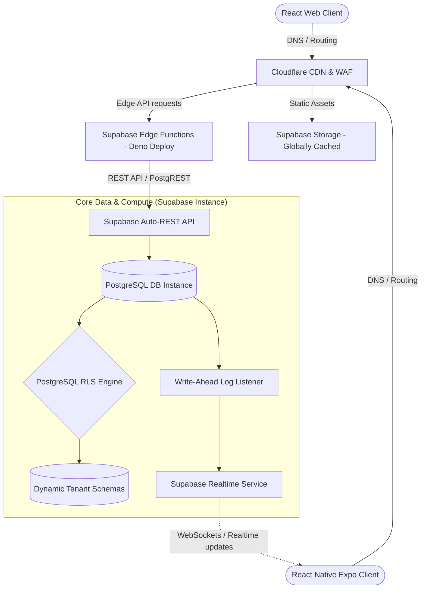
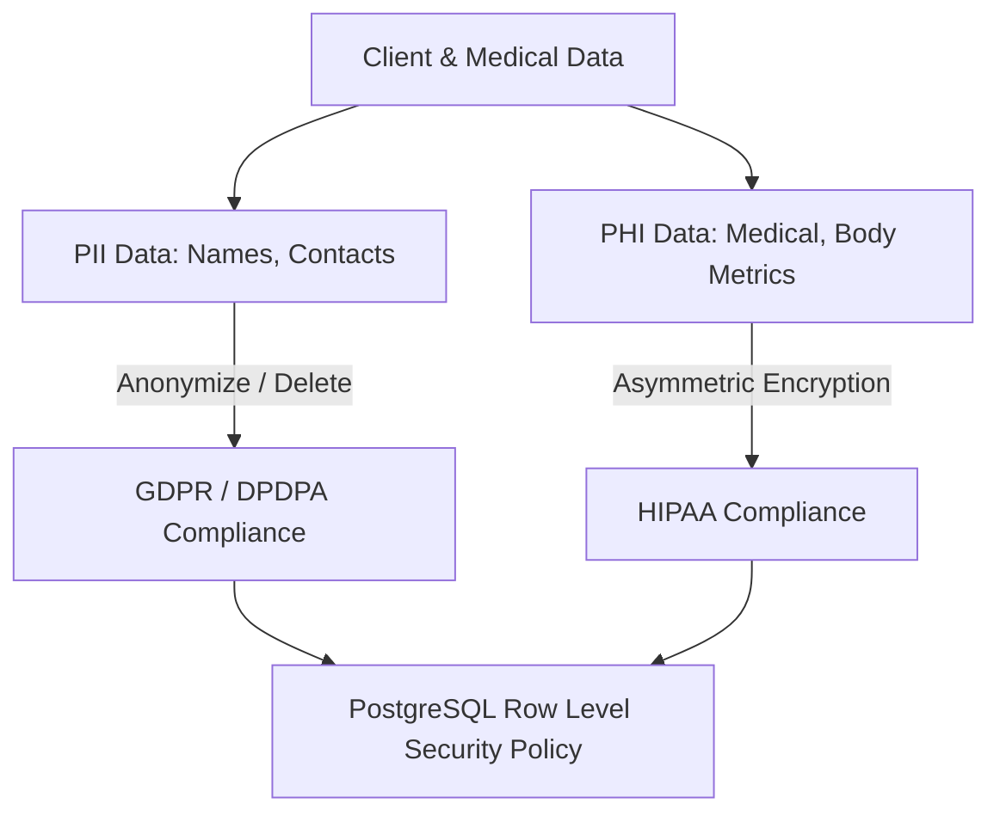
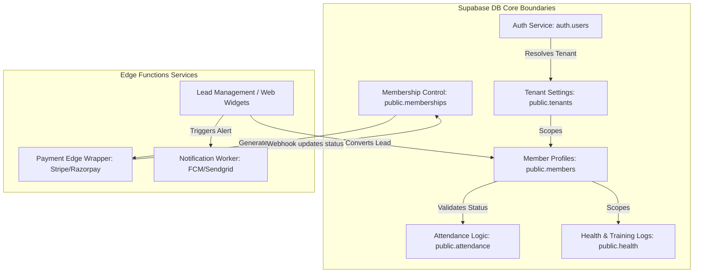
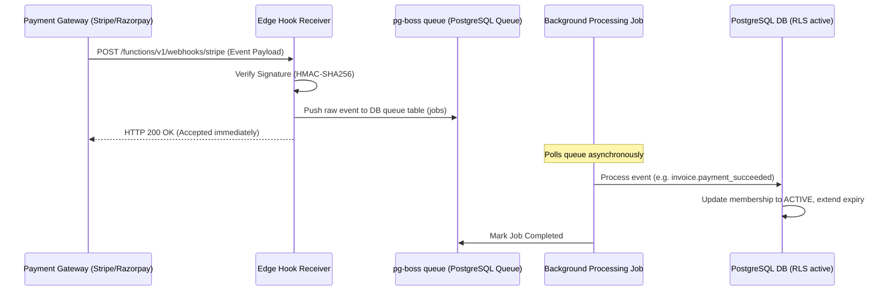

# 02. System Architecture & Monorepo Design

This document details the global technical architecture, regulatory compliance models, service boundaries, monorepo structure, and security design for the Gym Operating System using **Supabase, React, React Native (Expo), and multi-gateway payments**.

---

## 1. Global System Architecture

To ensure high performance and low latency worldwide, the system utilizes a globally distributed Edge-First topology.



### Multi-Tenant Data Isolation Strategy
We transition from NestJS schemas to **Supabase Row-Level Security (RLS) on a Shared Database, Single-Schema** or **Multi-Schema model**. Given Supabase's native auth model, we implement a **Single-Schema Shared Database with Tenant-Isolation at the Database/Table level using Row-Level Security (RLS)**. This is optimal for serverless scalability and real-time syncing.
- Every table containing tenant-scoped data includes a `tenant_id` column.
- The `auth.users` metadata stores the user's active `tenant_id`.
- The database enforces RLS policies checking:
  `tenant_id = (auth.jwt() -> 'user_metadata' ->> 'tenant_id')::uuid`

### Global Low-Latency Strategy
1.  **Distributed Edge Compute**: Supabase Edge Functions run globally on Deno's edge network, executing close to the user's physical location.
2.  **Edge Routing & Caching**: Cloudflare routes traffic and caches static assets and public branding profiles.
3.  **Read Replicas**: High-read tables (e.g. exercise libraries, class schedules) can be synced to local read-replicas for gyms in different continents, while writes flow back to the primary database.

---

## 2. Regulatory Compliance Architecture (GDPR, DPDPA, HIPAA)

Because gyms collect personal information, address records, billing details, and medical logs (injuries, health limitations, biometric assessments), the architecture must comply with global regulations.



### I. HIPAA (Health Insurance Portability and Accountability Act) Compliance
- **Protected Health Information (PHI) Isolation**: All medical records, physical assessment logs, and diet/injury notes must be stored in a dedicated table `member_health_records`.
- **Encryption-at-Rest**: Supabase encrypts all database storage at rest using AES-256. Critical PHI fields (e.g. `medical_notes`) undergo application-level asymmetric encryption before write.
- **Audit Logging**: Every read/write operation on PHI tables triggers an audit log in `audit.logs` detailing who accessed what record and when (via database triggers).

### II. GDPR & DPDPA (Digital Personal Data Protection Act) Compliance
- **Right to Be Forgotten**: Soft-deletes are avoided for PII data when a member requests account removal. A database function performs hard-deletes of the user's profile and anonymizes financial transaction records (to preserve billing compliance without retaining user identity).
- **Data Portability**: Edge functions allow members to request a structured JSON export of all personal, workout, and diet history.
- **Consent Logs**: User consent for terms of service, liability waivers, and privacy statements are timestamped, version-tracked, and stored immutably.

---

## 3. Module Diagram & Service Boundaries

We split service domains to maintain clean interfaces and prevent tight coupling.



---

## 4. Unified API Structure (Supabase Edge & REST)

We combine Supabase’s auto-generated REST API (PostgREST) with dedicated Deno Edge Functions for transactional or third-party integrations:

### Autogenerated REST Endpoints (CRUD via Supabase client)
- `/rest/v1/members` - Member operations (Read/Write filtered by RLS).
- `/rest/v1/attendance_logs` - Real-time check-ins (Read/Write filtered by RLS).
- `/rest/v1/workout_templates` - Workout designs.

### Edge Function Endpoints (Transactional & Custom Logics)
- `POST /functions/v1/onboard-tenant`: Automates initial workspace layout, binds billing subscription, sets up subdomains.
- `POST /functions/v1/payments/charge`: Multi-gateway selector routing payments to either Stripe Connect or Razorpay.
- `POST /functions/v1/attendance/verify-qr`: Time-locked HMAC validation for security check-ins.
- `POST /functions/v1/webhooks/stripe`: Stripe payment success/fail event processing.
- `POST /functions/v1/webhooks/razorpay`: Razorpay event processing.

---

## 5. Event Flow (Asynchronous Webhook Handling)

The platform handles third-party webhooks asynchronously to ensure resilience and avoid HTTP timeouts:



---

## 6. Monorepo Folder Structure

```
/
├── apps/
│   ├── web/                     # React + TypeScript Web App (Admin Portal & Gym Dashboard)
│   │   ├── src/
│   │   │   ├── components/      # Shared UI (Buttons, Cards, Layouts)
│   │   │   ├── contexts/        # Tenant context, Supabase Auth context
│   │   │   ├── hooks/           # useTenant, useRealtimeAttendance
│   │   │   ├── pages/           # Dashboard, CRM, Settings, Members
│   │   │   └── main.tsx
│   │   └── package.json
│   │
│   └── mobile/                  # React Native Mobile App (Expo optimized for Members)
│       ├── assets/              # Icons, splash screens
│       ├── src/
│       │   ├── components/      # Mobile components (QR Code Generator, Diet Tracker)
│       │   ├── hooks/           # useOfflineSync, useFCMNotifications
│       │   └── screens/         # Home, Checkin, Workouts, Profile
│       ├── app.json             # Expo config
│       └── package.json
│
├── supabase/                    # Backend Configuration & Database Code
│   ├── config.toml              # Supabase project configuration
│   ├── functions/               # Deno Edge Functions
│   │   ├── onboard-tenant/      # Tenant setup edge code
│   │   ├── verify-qr/           # Secure check-in verification
│   │   └── payment-wrapper/     # Multi-gateway payments router
│   │
│   ├── migrations/              # DB Schema, Triggers, RLS Policies
│   │   ├── 20260622000000_init_auth.sql
│   │   ├── 20260622000001_tenant_tables.sql
│   │   └── 20260622000002_rls_security.sql
│   │
│   └── seed.sql                 # Seed templates (Global Exercises, SaaS Plans)
│
├── packages/                    # Shared configurations and type definitions
│   ├── tsconfig/                # Global typescript rules
│   └── types/                   # Unified Database Types & API Interfaces
│
├── package.json                 # Monorepo Workspace Configuration (npm workspaces / Turborepo)
└── turbo.json                   # Build optimization caching configuration
```

---

## 7. Security Architecture & RLS Strategy

Row-Level Security (RLS) is the foundation of data isolation.

### Dynamic JWT Resolution
When a user logs in, Supabase includes their `tenant_id` and `role` inside the JWT payload metadata:
```json
{
  "sub": "user-uuid",
  "email": "user@gym.com",
  "app_metadata": {
    "provider": "email"
  },
  "user_metadata": {
    "tenant_id": "50c60da0-7c6d-4720-911e-b8d4abfdfb74",
    "role": "TRAINER"
  }
}
```

### Target RLS Isolation Policies
We enforce strict policies on every data table:

#### Members Table Access Control
- **Gym Owner / Admin**: Read & Write access for all records matching their `tenant_id`.
- **Receptionist / Staff**: Read access for members matching `tenant_id`, write restricted to check-in tags.
- **Member**: Read access restricted to their own record.

#### Health Records Table (HIPAA Restricted)
- **Trainer**: Read/Write access only if the member has assigned them as their active coach.
- **Member**: Read/Write access to their own logs.
- **Receptionist**: No access (RLS denies all requests).
- **Gym Owner**: Read-only access for compliance review.
