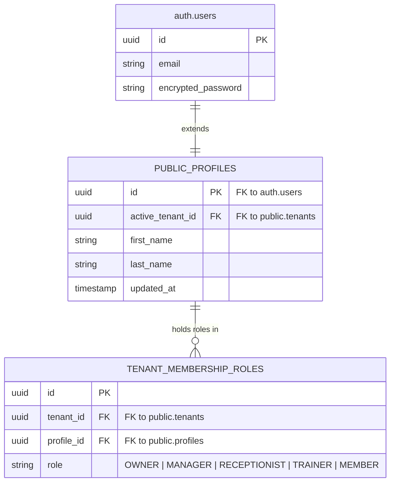
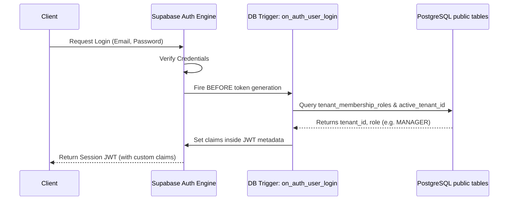

# 04. Authentication & Authorization Module

This document designs the authentication and authorization architecture for the Gym Operating System using **Supabase Auth**.

---

## 1. Database Schema Extensions

To support custom authorization logic on top of Supabase Auth, we extend the built-in identity engine with relational tables in the `public` schema.



### Table Definitions

#### `public.profiles`
Links standard user information directly with Supabase identity accounts.
*   `id`: `UUID` (Primary Key, References `auth.users` ON DELETE CASCADE)
*   `active_tenant_id`: `UUID` (References `public.tenants` - Used for session context)
*   `first_name`: `VARCHAR(50)` (Not Null)
*   `last_name`: `VARCHAR(50)` (Not Null)
*   `updated_at`: `TIMESTAMP WITH TIME ZONE`

#### `public.tenant_membership_roles`
Allows a single user profile to hold different roles across different gym locations (tenants).
*   `id`: `UUID` (Primary Key, Default: `gen_random_uuid()`)
*   `tenant_id`: `UUID` (Not Null, References `public.tenants` ON DELETE CASCADE)
*   `profile_id`: `UUID` (Not Null, References `public.profiles` ON DELETE CASCADE)
*   `role`: `VARCHAR(20)` (Not Null, Check: `IN ('OWNER', 'MANAGER', 'RECEPTIONIST', 'TRAINER', 'MEMBER')`)
*   
    CONSTRAINT unique_profile_tenant_role UNIQUE (tenant_id, profile_id, role)

---

## 2. Authentication & Authorization Flows

### I. Multi-Tenant Subdomain Login Flow
When a user accesses `https://apex.gymsaas.com/login`:
1.  Frontend parses host slug `apex` and requests the tenant configurations from `GET /api/v1/tenant/branding/public?slug=apex`.
2.  User enters credentials. Frontend calls Supabase Auth Client:
    `supabase.auth.signInWithPassword({ email, password })`
3.  A PostgreSQL database trigger fires on `auth.users` update to inject custom JWT claims (`tenant_id`, `role`) for the user's active tenant membership into the session token.

### II. Dynamic JWT Custom Claims Trigger Workflow


### III. Multi-Factor Authentication (MFA)
- Uses Supabase's native TOTP (Time-based One-time Password) engine.
- Enforced for roles: `OWNER`, `MANAGER`, and `Platform Admin`.
- Optional for roles: `TRAINER`, `RECEPTIONIST`, and `MEMBER`.

### IV. Cross-Domain Cookie Authentication (Custom Domains)
When a gym runs a custom domain (e.g. `members.gymname.com`):
1.  Supabase routes auth requests to the central domain `auth.gymsaas.com`.
2.  To maintain session access on `members.gymname.com`, we use Supabase Single Sign-On (SSO) or pass authorization tokens through URL query redirects verified at the edge:
    `https://members.gymname.com/auth/callback?access_token=...&refresh_token=...`
3.  The client sets these tokens in the custom domain's local storage and cookie domain scopes.

---

## 3. Permissions Matrix

| Module Action | Platform Admin | Gym Owner | Manager | Receptionist | Trainer | Member |
| :--- | :---: | :---: | :---: | :---: | :---: | :---: |
| **Manage SaaS Tenants** | Yes | No | No | No | No | No |
| **Edit Billing API Keys**| No | Yes | No | No | No | No |
| **Adjust Gym Branding** | No | Yes | Yes | No | No | No |
| **Hire/Edit Staff** | No | Yes | Yes | No | No | No |
| **Issue Invoices/Refunds**| No | Yes | Yes | Yes | No | No |
| **Onboard Members** | No | Yes | Yes | Yes | No | No |
| **Log Attendance** | No | Yes | Yes | Yes | No | No |
| **Assign Workouts/Diets**| No | No | Yes | No | Yes | No |
| **Access HIPAA Health Records**| No | Yes (Read Only)| Yes (Read Only)| No | Yes | Yes |
| **Log Personal Workout** | No | No | No | No | No | Yes |
| **View Invoices (Self)** | No | No | No | No | No | Yes |

---

## 4. Authentication APIs

### Supabase SDK Authentication wrappers
- **Login User**: `supabase.auth.signInWithPassword({ email, password })`
- **Logout User**: `supabase.auth.signOut()`
- **Send Reset Email**: `supabase.auth.resetPasswordForEmail(email, { redirectTo })`
- **Update Password**: `supabase.auth.updateUser({ password })`

### Custom Edge Auth Actions
- `POST /functions/v1/auth/switch-tenant`
  - **Headers**: Authorization Bearer JWT
  - **Body**: `{ "targetTenantId": "uuid" }`
  - **Action**: Updates `public.profiles.active_tenant_id` for the user and forces a session refresh to generate a new JWT with the new tenant's context and role.

---

## 5. Directory & Monorepo Folder Structure

```
/
├── apps/
│   ├── web/
│   │   └── src/
│   │       ├── contexts/
│   │       │   └── AuthContext.tsx       # Auth provider supplying user, session, and role state
│   │       └── hooks/
│   │           └── usePermission.ts      # Permission check hook: e.g. usePermission('billing:write')
│   │
│   └── mobile/
│       └── src/
│           ├── contexts/
│           │   └── AuthContext.tsx       # Handles React Native authentication storage
│           └── hooks/
│               └── useSecureStorage.ts   # Secure Keychain/KeyStore integration for JWT tokens
│
└── supabase/
    └── migrations/
        ├── 20260622000003_auth_profiles.sql  # Creates public.profiles & triggers
        └── 20260622000004_custom_claims.sql   # Creates SQL functions to inject claims into JWT
```

---

## 6. Edge Cases & Mitigations

### I. Tenant Switching
- **Scenario**: A Personal Trainer works at Gym A (Trainer role) and Gym B (Manager role) using the same email address.
- **Mitigation**: When logging in, the default profile resolves to the last accessed `active_tenant_id`. In the dashboard, the user is presented with a "Switch Gym" dropdown. Choosing a gym updates `public.profiles.active_tenant_id` via Edge Function, and the client calls `supabase.auth.refreshSession()` to issue a new JWT containing the target gym's `tenant_id` and role permissions.

### II. Active Token Revocation (Role Downgrade / Termination)
- **Scenario**: A receptionist is terminated, but their local JWT remains valid for 1 hour.
- **Mitigation**: Critical endpoints (e.g. gateway charges, database modification queries) verify staff status directly against the DB cache in Redis rather than relying solely on the stateless JWT payload expiration. When staff status is toggled to `is_active = false`, the system pushes an invalidation event to Redis, instantly rejecting subsequent operations.

### III. Session Hijacking Prevention
- **Scenario**: Attacker steals the user's JWT from storage.
- **Mitigation**: Cookies are configured as `HttpOnly`, `Secure`, and `SameSite=Strict`. For mobile clients, access tokens are tied to IP addresses and user-agent fingerprints stored in the active session database table. If a request is received from a matching token but a different IP/agent fingerprint, the session is flagged and invalidated.

### IV. Offline PWA Token Expiration
- **Scenario**: A user goes offline inside a gym basement, and their access token expires while they need to generate their check-in QR code.
- **Mitigation**: The dynamic QR generator relies on a local key vector cached securely in local storage. While offline, the app continues to generate HMAC check-in codes valid for 15-second windows, using the cached key vector that persists beyond token expirations.
