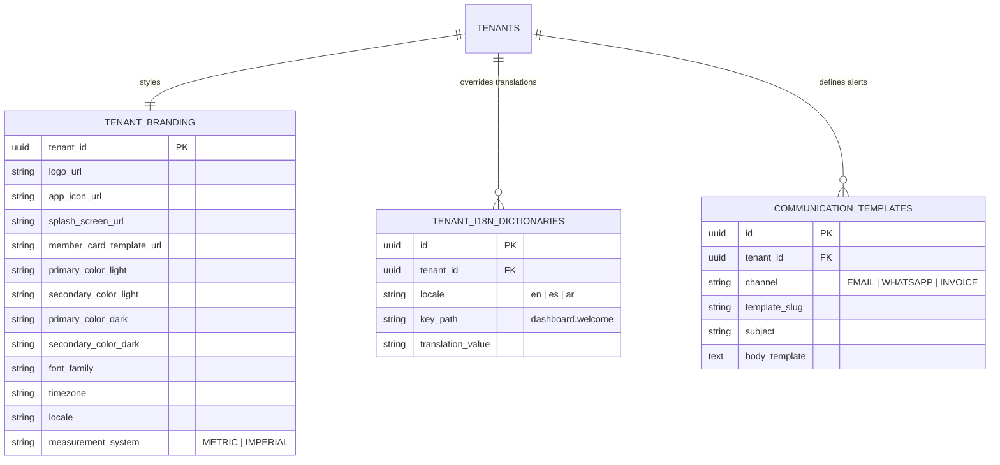
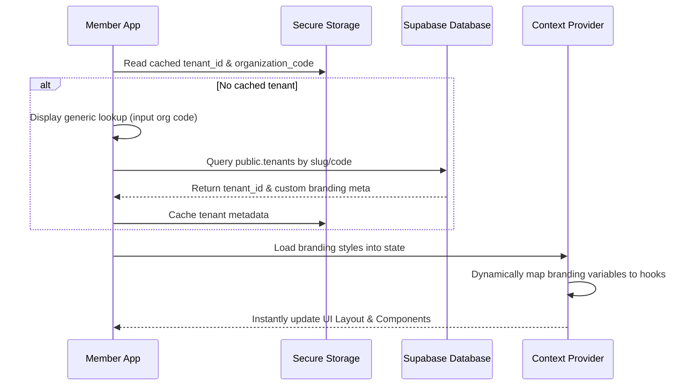
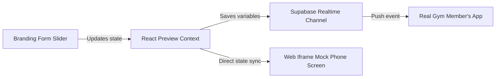

# 05. White Label, Branding & Localization Module

This document designs a no-code white-label branding and internationalization (i18n) localization engine. All configurations resolve dynamically at runtime within a single master application wrapper using the `tenant_id`.

---

## 1. Database Schema

We support custom themes, regional configurations, dynamic communication templates, and localized translation dictionary overrides in the database.

### Table Definitions

#### `public.tenant_branding`
*   `tenant_id`: `UUID` (Primary Key, References `public.tenants(id)` ON DELETE CASCADE)
*   `logo_url`: `TEXT` (CDN image path)
*   `app_icon_url`: `TEXT`
*   `splash_screen_url`: `TEXT`
*   `member_card_template_url`: `TEXT` (Coordinates/layers setup for digital membership passes)
*   `primary_color_light`: `CHAR(7)` (Default: `'#f59e0b'`)
*   `secondary_color_light`: `CHAR(7)` (Default: `'#0f172a'`)
*   `primary_color_dark`: `CHAR(7)` (Default: `'#fbbf24'`)
*   `secondary_color_dark`: `CHAR(7)` (Default: `'#1e293b'`)
*   `font_family`: `VARCHAR(50)` (Default: `'Inter'`)
*   `timezone`: `VARCHAR(100)` (Default: `'UTC'`)
*   `locale`: `VARCHAR(10)` (Default: `'en'`)
*   `measurement_system`: `VARCHAR(10)` (Default: `'METRIC'`, Check: `IN ('METRIC', 'IMPERIAL')`)

#### `public.tenant_i18n_dictionaries`
Allows gyms to override default text strings on the fly (e.g. changing "Trainer" to "Coach", or translating to a local dialect).
*   `id`: `UUID` (Primary Key, Default: `gen_random_uuid()`)
*   `tenant_id`: `UUID` (References `public.tenants(id)` ON DELETE CASCADE)
*   `locale`: `VARCHAR(10)` (e.g. `'en-US'`)
*   `key_path`: `VARCHAR(255)` (e.g. `'menu.trainers_tab'`)
*   `translation_value`: `TEXT` (e.g. `'Coaches'`)
*   
    CONSTRAINT unique_tenant_locale_key UNIQUE (tenant_id, locale, key_path)

#### `public.communication_templates`
*   `id`: `UUID` (Primary Key, Default: `gen_random_uuid()`)
*   `tenant_id`: `UUID` (References `public.tenants(id)` ON DELETE CASCADE)
*   `channel`: `VARCHAR(10)` (Check: `IN ('EMAIL', 'WHATSAPP', 'INVOICE')`)
*   `template_slug`: `VARCHAR(100)` (e.g. `'invoice_receipt'`)
*   `subject`: `VARCHAR(255)` (Nullable, used for Email)
*   `body_template`: `TEXT` (Handlebars template format)
*   
    CONSTRAINT unique_tenant_template_slug UNIQUE (tenant_id, template_slug)

---

## 2. Dynamic Theme Engine Architecture (Master App Wrapper)

The React Native (Expo) app functions as a single **Master App** published to the App Store. It does not require re-compilation to update branding assets.

### Style Application Mappings
The context wraps the app components and supplies a calculated stylesheet:
- **Light Theme**:
  - Primary: `theme.primary_color_light`
  - Secondary: `theme.secondary_color_light`
  - Background: Default slate/neutral values
- **Dark Theme**:
  - Primary: `theme.primary_color_dark`
  - Secondary: `theme.secondary_color_dark`
  - Background: Configurable base hex
- **Typography Resolution**: Fonts are resolved dynamically at runtime by loading Google Font profiles via React Native Expo Google Fonts library metadata endpoints.

---

## 3. Asset Storage & CDN Optimization

- **Storage Bucket**: A private bucket `branding-assets` handles uploads via Supabase Storage.
- **Pathing Convention**: `/tenants/:tenant_id/branding/:asset_type.(png|jpg)`
- **Cloudflare CDN Optimization**:
  - Assets are delivered via Cloudflare CDN caching.
  - Image scaling variables are appended to request headers to compress images dynamically before serving to mobile apps (e.g. serving logo at `width=300` instead of original upload size).

---

## 4. Global Localization Architecture

### I. Right-to-Left (RTL) Layouts
- The app checks the resolved locale's direction (e.g., Arabic `ar` -> RTL).
- In React Native, the engine calls `I18nManager.forceRTL(isRTL)` and triggers an application reload to flip layout directions automatically.
- CSS layout systems utilize start/end attributes (Flexbox `justify-content: flex-start` -> `flex-end` dynamically mapped via standard dynamic padding/margin styling adapters).

### II. Localized Date/Time Formatting
- The tenant database records define the gym timezone (e.g., `Asia/Kolkata`, `America/New_York`).
- Display times (class bookings, attendance logs) are stored in UTC in PostgreSQL.
- Display layer maps dates using the timezone metadata:
  $$\text{Display Time} = \text{UTC Time} \pm \text{Timezone Offset}$$
- Number format standards (currency codes like `$`, `₹`, `€` and digit formats) are set dynamically according to the resolved locale (e.g. `new Intl.NumberFormat(locale)`).

### III. Measurement Unit Toggle
- Core database logs store weight values in Kilograms (kg) and height metrics in Centimeters (cm).
- Display mapping automatically executes conversion logic:
  - If `measurement_system == 'IMPERIAL'`:
    $$\text{Weight (lbs)} = \text{Weight (kg)} \times 2.20462$$
    $$\text{Height (in)} = \text{Height (cm)} \times 0.393701$$

---

## 5. Live Preview API & State Management

Admin settings feature a real-time layout editor.

### State Management & Real-Time Sync Protocols
1.  **Draft State**: Admin changes color sliders. Changes are held locally in React state (`draftBranding`).
2.  **Mock Device Iframe**: The settings panel renders an HTML/CSS phone simulator inside an iframe. The iframe receives the updated `draftBranding` state via postMessage communication, instantly re-rendering components.
3.  **Real-Time Mobile Sync**: Clicking "Save Branding" pushes updates to `public.tenant_branding`. An active WebSocket listener on Supabase Realtime channel triggers:
    `supabase.channel('branding-changes').on('postgres_changes', ...)`
    The member app listens to this channel and updates color states dynamically on users' devices.
