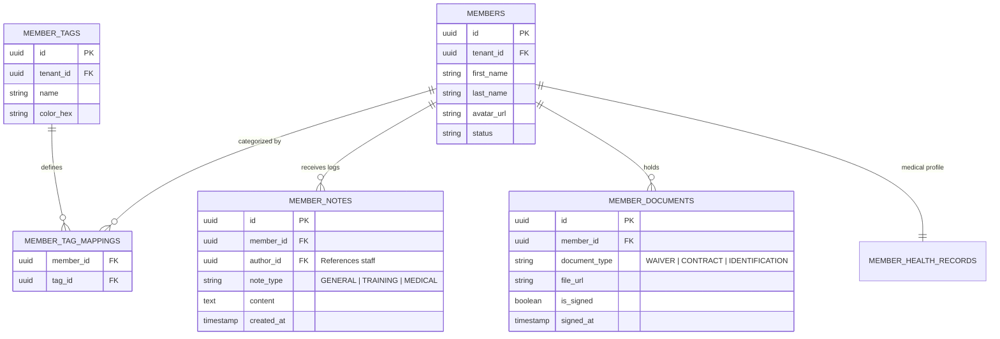
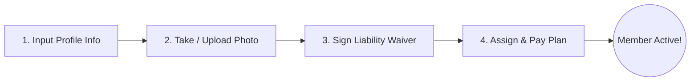

# 06. Member Module

This document designs the member profile management system, detailing schemas, automated business rules, REST APIs, and UI flows.

---

## 1. Database Schema Extensions

To support tags, document history, and staff notes on top of the core member records, we utilize the following schema extensions in the `public` namespace:



### Table Definitions

#### `public.member_tags`
*   `id`: `UUID` (Primary Key, Default: `gen_random_uuid()`)
*   `tenant_id`: `UUID` (Not Null, References `public.tenants(id)` ON DELETE CASCADE)
*   `name`: `VARCHAR(50)` (Not Null)
*   `color_hex`: `CHAR(7)` (Not Null, Default: `'#6b7280'`)
*   
    CONSTRAINT unique_tenant_tag_name UNIQUE (tenant_id, name)

#### `public.member_tag_mappings`
*   `member_id`: `UUID` (References `public.members(id)` ON DELETE CASCADE)
*   `tag_id`: `UUID` (References `public.member_tags(id)` ON DELETE CASCADE)
*   
    PRIMARY KEY (member_id, tag_id)

#### `public.member_notes`
*   `id`: `UUID` (Primary Key, Default: `gen_random_uuid()`)
*   `member_id`: `UUID` (Not Null, References `public.members(id)` ON DELETE CASCADE)
*   `author_id`: `UUID` (Not Null, References `public.staff(id)`)
*   `note_type`: `VARCHAR(15)` (Not Null, Default: `'GENERAL'`, Check: `IN ('GENERAL', 'TRAINING', 'MEDICAL')`)
*   `content`: `TEXT` (Not Null)
*   `created_at`: `TIMESTAMP WITH TIME ZONE` (Default: `now()`)

#### `public.member_documents`
*   `id`: `UUID` (Primary Key, Default: `gen_random_uuid()`)
*   `member_id`: `UUID` (Not Null, References `public.members(id)` ON DELETE CASCADE)
*   `document_type`: `VARCHAR(20)` (Not Null, Check: `IN ('WAIVER', 'CONTRACT', 'IDENTIFICATION')`)
*   `file_url`: `TEXT` (Not Null)
*   `is_signed`: `BOOLEAN` (Default: `false`)
*   `signed_at`: `TIMESTAMP WITH TIME ZONE`

---

## 2. Business Rules & Automation Gates

### I. Onboarding & Access Gates (Waiver Compliance)
1.  **Waiver Compliance Check**: A member must sign all documents flagged as `mandatory` (such as the liability waiver) before they are marked `ACTIVE`.
2.  **Gate Access Intercept**: If a member checks in via QR/RFID, and their profile is missing a signed waiver or a profile photo, the gate returns:
    `{ "granted": false, "reason": "MISSING_DOCUMENTS" }`
    The member app prompts the user to upload a photo or sign terms in-app.

### II. Membership Freeze Rules
1.  **Minimum Freeze Duration**: A freeze request must span at least 7 days.
2.  **Maximum Freezes Limit**: A member cannot exceed the maximum freeze frequency allowed by their membership plan (e.g., max 3 freezes per year).
3.  **Active Date Modifications**: Applying a freeze automatically sets the current membership status to `FROZEN`. The membership expiration date (`end_date`) is extended by the exact number of frozen days.

### III. Tag Automation System
The database automatically handles member tag mappings based on events:
- **`PAYMENT_OVERDUE` Tag**: Automatically applied to a member if an invoice remains unpaid 2 days after the due date. The tag is automatically removed when the invoice transitions to `PAID`.
- **`BIRTHDAY` Tag**: Applied on the day matching the member's `dob` date, enabling quick greeting tags on receptionist check-in dashboard views.

---

## 3. Member Module APIs

All requests require tenant authorization headers.

### I. Onboard / Add Member
`POST /api/v1/members`
- **Body**:
  ```json
  {
    "firstName": "John",
    "lastName": "Connor",
    "email": "john@resistance.org",
    "phone": "+15552029",
    "dob": "1985-02-28"
  }
  ```
- **Response**: `{ "success": true, "memberId": "uuid", "qrCodeToken": "qr-tok-xyz" }`

### II. Search & Filter Members
`GET /api/v1/members/search`
- **Query Params**:
  - `query` (Searches first name, last name, email, phone)
  - `status` (ACTIVE, INACTIVE, FROZEN, SUSPENDED)
  - `tagIds` (Array of UUID tags, filters members containing ALL selected tags)
- **Response**: Paginated array of matching member profiles.

### III. Add Tag to Member
`POST /api/v1/members/:id/tags`
- **Body**: `{ "tagId": "uuid" }`
- **Response**: `{ "success": true }`

### IV. Write Note
`POST /api/v1/members/:id/notes`
- **Body**: `{ "noteType": "MEDICAL", "content": "Asthma history. Keep inhaler nearby." }`
- **Response**: `{ "success": true, "noteId": "uuid" }`

---

## 4. UI Flows & Wireframe Layouts

### I. Member Onboarding Workflow


1.  **Step 1: Profile Details**: Input name, contact details, date of birth, emergency contact.
2.  **Step 2: Profile Photo**: Web camera capture tool on tablet/desktop, or file picker.
3.  **Step 3: Waiver Signature**: Canvas signing window. Renders dynamic waiver template text.
4.  **Step 4: Purchase Plan**: Select membership tier. Initiates checkout via Stripe Reader (walk-in) or Credit Card form.
5.  **Step 5: Access Granted**: Displays QR Code shortcut, logs member as `ACTIVE`.

### II. Profile View Layout (Responsive Web & Mobile Dashboard)
- **Left Sidebar Panel (Quick Look)**:
  - Profile avatar image with status ring indicator (Green = Active, Red = Suspended, Yellow = Frozen).
  - Main action buttons: `Check In`, `Freeze Membership`, `Suspend Account`.
  - Tags container: Displays color-coded pills (e.g. `VIP`, `Injured`, `Student`).
- **Main Content Panel (Tabbed View)**:
  1.  **Overview**: Basic information, check-in history charts, emergency details.
  2.  **Memberships**: List of active and historical plans, payments history, freeze controls.
  3.  **Health (HIPAA Restricted)**: Encrypted medical logs, injuries warning list, biometric history graphs.
  4.  **Documents**: List of signed contracts and ID uploads.
  5.  **Notes**: Timeline feed of staff comments and trainer reviews.
