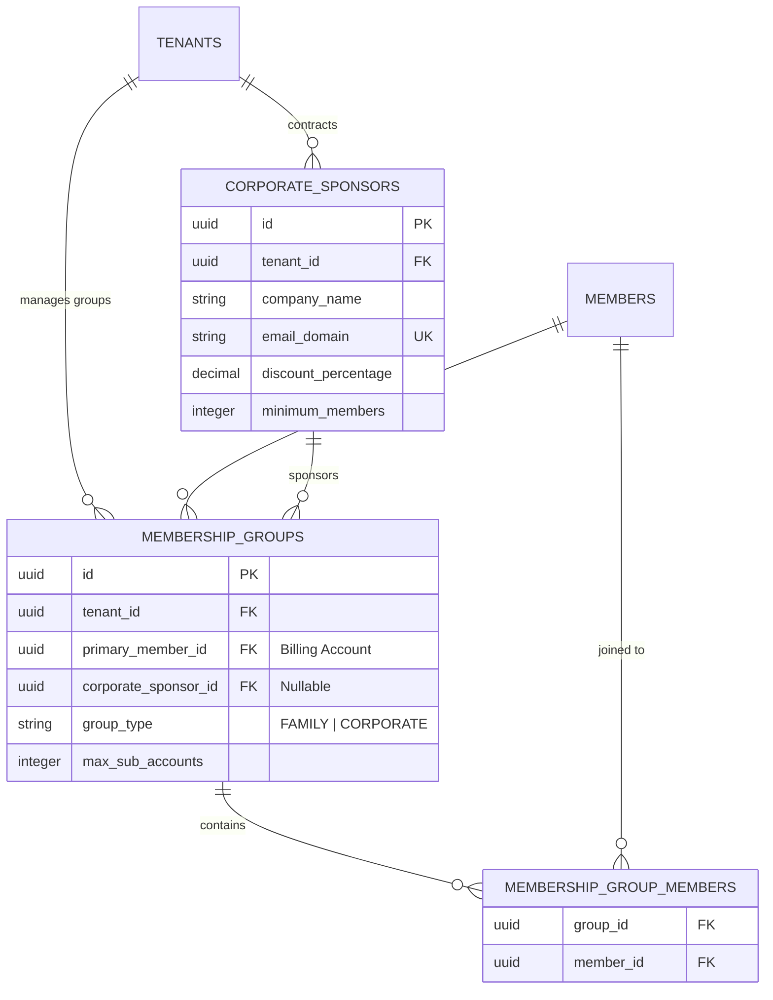

# 07. Membership & Subscription Module

This document designs the membership plans, renewal engines, upgrades/downgrades proration logic, group/family subscriptions, and corporate sponsor contracts.

---

## 1. Database Schema Extensions

To support family groups, corporate sponsors, and renewal auditing, we extend the membership schema:



### Table Definitions

#### `public.corporate_sponsors`
*   `id`: `UUID` (Primary Key, Default: `gen_random_uuid()`)
*   `tenant_id`: `UUID` (Not Null, References `public.tenants(id)`)
*   `company_name`: `VARCHAR(100)` (Not Null)
*   `email_domain`: `VARCHAR(100)` (Not Null) -- e.g. `'@google.com'`
*   `discount_percentage`: `NUMERIC(5, 2)` (Default: `0.00` Check: `discount_percentage >= 0 AND discount_percentage <= 100`)
*   `minimum_members`: `INTEGER` (Default: `5` Check: `minimum_members > 0`)
*   
    CONSTRAINT unique_tenant_company_domain UNIQUE (tenant_id, email_domain)

#### `public.membership_groups`
Defines grouping for shared billing (Family plans) or corporate memberships.
*   `id`: `UUID` (Primary Key, Default: `gen_random_uuid()`)
*   `tenant_id`: `UUID` (Not Null, References `public.tenants(id)`)
*   `primary_member_id`: `UUID` (Not Null, References `public.members(id)`)
*   `corporate_sponsor_id`: `UUID` (References `public.corporate_sponsors(id)`)
*   `group_type`: `VARCHAR(15)` (Check: `IN ('FAMILY', 'CORPORATE')`)
*   `max_sub_accounts`: `INTEGER` (Default: `4` Check: `max_sub_accounts >= 0`)

#### `public.membership_group_members`
*   `group_id`: `UUID` (References `public.membership_groups(id)` ON DELETE CASCADE)
*   `member_id`: `UUID` (References `public.members(id)` ON DELETE CASCADE)
*   
    PRIMARY KEY (group_id, member_id)

---

## 2. Business Rules & Calculations

### I. Proration Rules (Upgrades & Downgrades)
When a member upgrades their plan mid-billing cycle:
1.  **Daily Rate Calculation**:
    $$\text{Daily Rate}_{\text{old}} = \frac{\text{Price}_{\text{old}}}{\text{Duration Days}_{\text{old}}}$$
2.  **Unused Credit (Prorated)**:
    $$\text{Unused Days} = \text{End Date}_{\text{current}} - \text{Date}_{\text{today}}$$
    $$\text{Prorated Credit} = \text{Unused Days} \times \text{Daily Rate}_{\text{old}}$$
3.  **Upgrade Charge Due**:
    $$\text{Charge Due} = \text{Price}_{\text{new}} - \text{Prorated Credit}$$
4.  **Date Realignment**: The old membership is closed (`status = 'EXPIRED'`), and the new membership plan starts immediately with `end_date = today + plan.duration_days`.

### II. Corporate Eligibility Threshold Gate
To keep the corporate discount valid:
- **Rule**: If the count of active members under a `corporate_sponsor_id` falls below the `minimum_members` threshold:
  - An event `corporate.threshold_breached` is triggered.
  - The gym owner is alerted.
  - At the next billing cycle, renewals default to the standard plan rate unless more corporate members join.

### III. Daily Expiry Check (Cron Job)
- Every night at 00:01 (local timezone offset), the system selects all memberships where `end_date = yesterday` and `status = 'ACTIVE'`:
  - If plan `is_recurring` is `true`, it initiates payment charge.
  - If plan `is_recurring` is `false`, it sets membership status to `'EXPIRED'` and member status to `'INACTIVE'`.
  - Dispatches `membership.expired` event.

---

## 3. Membership APIs

All requests require authorization headers.

### I. Calculate Upgrade Proration
`GET /api/v1/memberships/:membershipId/prorate-upgrade`
- **Query Params**: `targetPlanId`
- **Response**:
  ```json
  {
    "unusedDays": 15,
    "proratedCredit": 25.00,
    "newPlanPrice": 60.00,
    "amountDue": 35.00
  }
  ```

### II. Apply Plan Upgrade
`POST /api/v1/memberships/:membershipId/upgrade`
- **Body**: `{ "targetPlanId": "uuid", "idempotencyKey": "uuid" }`
- **Action**: Processes upgrade payment of `amountDue`, terminates active membership, provisions new membership starting today.
- **Response**: `{ "success": true, "newMembershipId": "uuid" }`

### III. Onboard Family Group
`POST /api/v1/memberships/groups`
- **Body**:
  ```json
  {
    "primaryMemberId": "uuid",
    "groupType": "FAMILY",
    "subAccountMemberIds": ["uuid", "uuid"]
  }
  ```
- **Response**: `{ "success": true, "groupId": "uuid" }`

---

## 4. System-Wide Events

The module publishes JSON event payloads to the system message bus (processed by notification and automation engines):

### Event: `membership.expired`
```json
{
  "eventId": "event-uuid",
  "eventType": "membership.expired",
  "timestamp": "2026-06-22T00:01:00Z",
  "payload": {
    "tenantId": "tenant-uuid",
    "memberId": "member-uuid",
    "membershipId": "membership-uuid",
    "planName": "3-Month Access"
  }
}
```

### Event: `membership.frozen`
```json
{
  "eventId": "event-uuid",
  "eventType": "membership.frozen",
  "timestamp": "2026-06-22T10:30:00Z",
  "payload": {
    "tenantId": "tenant-uuid",
    "memberId": "member-uuid",
    "membershipId": "membership-uuid",
    "freezeId": "freeze-uuid",
    "startDate": "2026-07-01",
    "endDate": "2026-07-15"
  }
}
```
 oily
