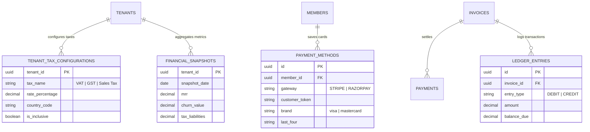
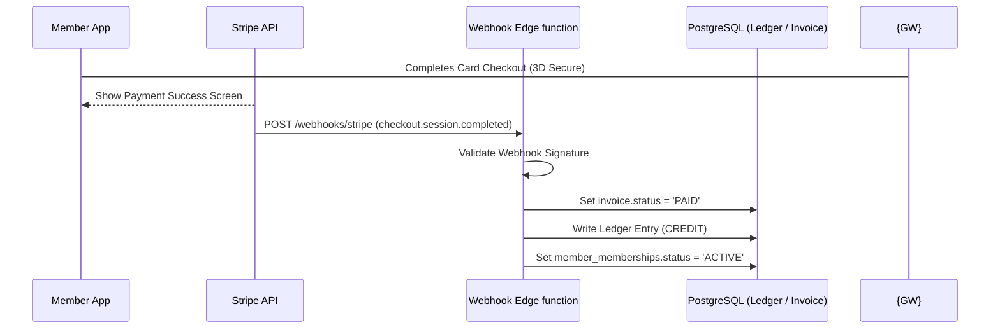
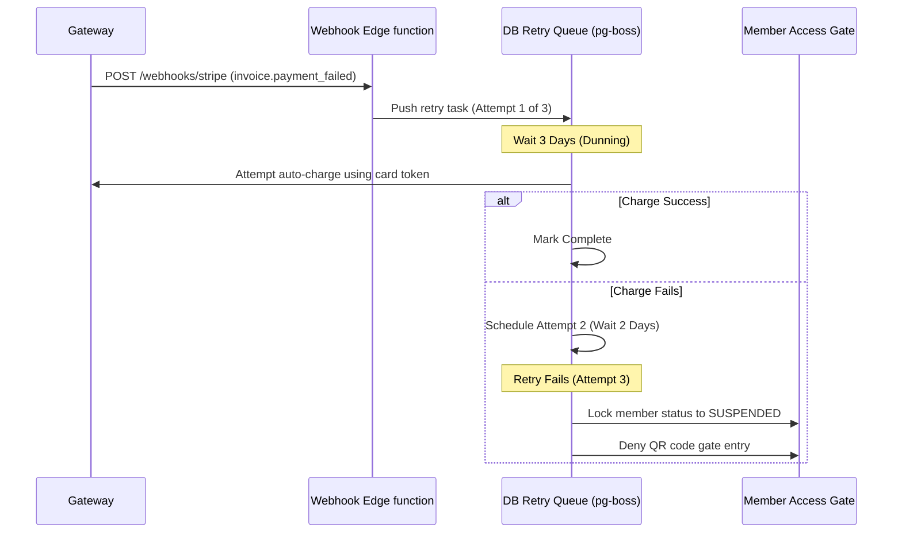

# 08. Payment & Billing Module

This document designs a global multi-tenant payment, billing, and subscription engine using Stripe Connect (Global) and Razorpay (India), incorporating automated taxation and dunning management.

---

## 1. Complete Database Schema (Billing & Ledger)

The schema isolates billing transactions, tax rules, and general ledger records to ensure audit compliance.



### Table Definitions

#### `public.tenant_tax_configurations`
*   `tenant_id`: `UUID` (Primary Key, References `public.tenants(id)` ON DELETE CASCADE)
*   `tax_name`: `VARCHAR(50)` (Not Null) -- e.g. `'GST'`, `'VAT'`, `'US Sales Tax'`
*   `rate_percentage`: `NUMERIC(5, 2)` (Not Null, CHECK `rate_percentage >= 0`)
*   `country_code`: `CHAR(2)` (Not Null) -- e.g. `'IN'`, `'US'`, `'GB'`
*   `state_code`: `CHAR(2)` (Nullable, e.g. `'NY'`, `'MH'`)
*   `is_inclusive`: `BOOLEAN` (Default: `false`)

#### `public.payment_methods`
*   `id`: `UUID` (Primary Key, Default: `gen_random_uuid()`)
*   `tenant_id`: `UUID` (Not Null, References `public.tenants(id)`)
*   `member_id`: `UUID` (Not Null, References `public.members(id)` ON DELETE CASCADE)
*   `gateway`: `payment_gateway` (Not Null)
*   `customer_token`: `VARCHAR(255)` (Not Null) -- Gateway customer ID
*   `payment_method_token`: `VARCHAR(255)` -- Card reference token
*   `brand`: `VARCHAR(30)`
*   `last_four`: `CHAR(4)`
*   `expires_at`: `DATE`

#### `public.ledger_entries`
Double-entry bookkeeping table tracking member credit and debit balances.
*   `id`: `UUID` (Primary Key, Default: `gen_random_uuid()`)
*   `tenant_id`: `UUID` (Not Null, References `public.tenants(id)`)
*   `member_id`: `UUID` (Not Null, References `public.members(id)`)
*   `invoice_id`: `UUID` (References `public.invoices(id)`)
*   `entry_type`: `VARCHAR(10)` (Check: `IN ('DEBIT', 'CREDIT')`) -- DEBIT increases outstanding amount, CREDIT represents payments/adjustments.
*   `amount`: `NUMERIC(10, 2)` (Not Null)
*   `balance_due`: `NUMERIC(10, 2)` (Not Null) -- Accumulation of unpaid member balance
*   `created_at`: `TIMESTAMP WITH TIME ZONE` (Default: `now()`)

---

## 2. API Definitions

### I. Create Checkout Session (Multi-Gateway Routing)
`POST /api/v1/payments/checkout-session`
- **Routing Logic**: Backend resolves tenant location and member IP/address country. If country is `'IN'`, it routes payload to Razorpay Order API; otherwise, it resolves to Stripe Checkout Session API.
- **Body**:
  ```json
  {
    "memberId": "uuid",
    "membershipPlanId": "uuid",
    "billingCountry": "US"
  }
  ```
- **Response (Stripe Routing)**:
  `{ "gateway": "STRIPE", "sessionId": "cs_live_...", "checkoutUrl": "https://checkout.stripe.com/..." }`
- **Response (Razorpay Routing)**:
  `{ "gateway": "RAZORPAY", "orderId": "order_xyz...", "amount": 5000, "currency": "INR" }`

### II. Stripe Webhook Endpoint
`POST /api/v1/payments/webhooks/stripe`
- **Action**: Verifies signature. Maps events to queue:
  - `checkout.session.completed` -> Mark invoice paid.
  - `invoice.payment_failed` -> Initiate dunning sequence.
  - `charge.disputed` -> Freeze member portal access.

### III. Razorpay Webhook Endpoint
`POST /api/v1/payments/webhooks/razorpay`

---

## 3. Global Event Flows

### Successful Payment Flow


### Failed Payment & Dunning Flow (Retry Queue)


### Disputed Payments Flow (Chargebacks)
1.  **Dispute Triggered**: Member disputes a charge with their bank. Stripe sends `charge.dispute.created` webhook.
2.  **State Modifications**:
    - The target invoice is marked `VOID` or `DISPUTED`.
    - A `DEBIT` ledger entry is written to adjust the balance:
      $$\text{Outstanding Balance} = \text{Invoice Price} + \text{Dispute Fee}$$
    - The member's status is set to `SUSPENDED` instantly.
3.  **Owner Alert**: Gym owner dashboard flags the dispute, offering options to submit evidence.

---

## 4. Financial Reporting Schema

We store daily aggregated financial snapshots in `public.financial_snapshots`:

```sql
CREATE TABLE public.financial_snapshots (
    tenant_id UUID NOT NULL REFERENCES public.tenants(id) ON DELETE CASCADE,
    snapshot_date DATE NOT NULL,
    total_mrr NUMERIC(12, 2) NOT NULL DEFAULT 0.00,
    churn_value NUMERIC(12, 2) NOT NULL DEFAULT 0.00,
    tax_liabilities JSONB NOT NULL DEFAULT '{}'::jsonb, -- Accrued tax grouped by tax_name (VAT, GST)
    currency CHAR(3) NOT NULL DEFAULT 'USD',
    
    PRIMARY KEY (tenant_id, snapshot_date)
);
```

### Sample Snapshot JSON Content
```json
{
  "tenant_id": "50c60da0-7c6d-4720-911e-b8d4abfdfb74",
  "snapshot_date": "2026-06-22",
  "total_mrr": 12450.00,
  "churn_value": 450.00,
  "tax_liabilities": {
    "GST": { "taxable_amount": 8000.00, "tax_collected": 1440.00 },
    "VAT": { "taxable_amount": 3000.00, "tax_collected": 600.00 }
  },
  "currency": "USD"
}
```
 oily
