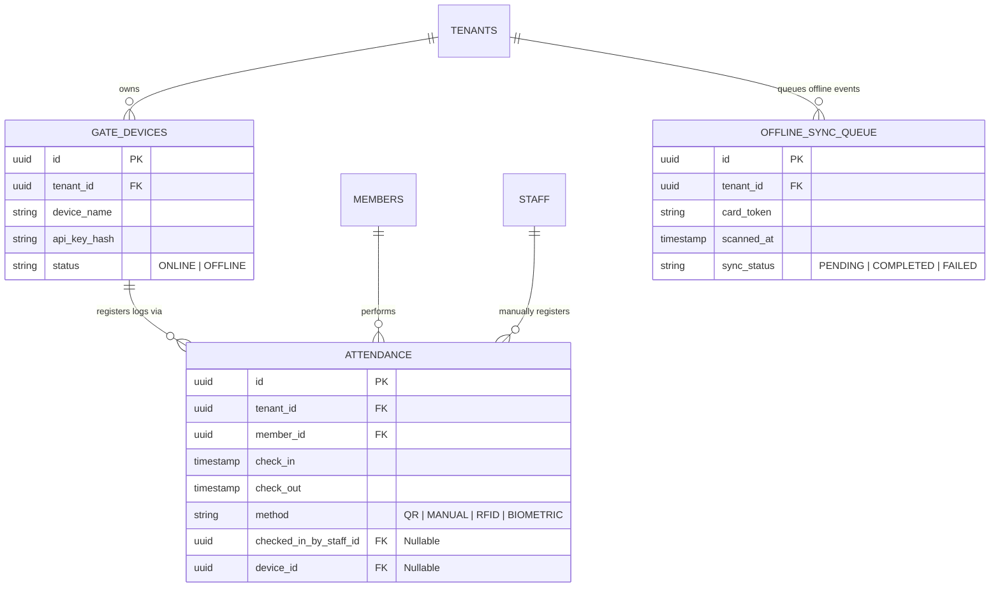

# 09. Attendance Module

This document designs the attendance verification engine, detailing database schemas, check-in APIs, edge cases (including offline gates), and reporting formats.

---

## 1. Database Schema Extensions

To support hardware devices, staff manual overrides, and offline sync logs, we extend the attendance schema:



### Table Definitions

#### `public.gate_devices`
Registers local ESP32/Raspberry Pi turnstile gates or check-in tablets.
*   `id`: `UUID` (Primary Key, Default: `gen_random_uuid()`)
*   `tenant_id`: `UUID` (Not Null, References `public.tenants(id)` ON DELETE CASCADE)
*   `device_name`: `VARCHAR(100)` (Not Null)
*   `api_key_hash`: `VARCHAR(255)` (Not Null, Secure device token hash)
*   `status`: `VARCHAR(20)` (Default: `'ONLINE'`, Check: `IN ('ONLINE', 'OFFLINE')`)

#### `public.attendance`
*   `id`: `UUID` (Primary Key, Default: `gen_random_uuid()`)
*   `tenant_id`: `UUID` (Not Null, References `public.tenants(id)`)
*   `member_id`: `UUID` (Not Null, References `public.members(id)` ON DELETE CASCADE)
*   `check_in`: `TIMESTAMP WITH TIME ZONE` (Not Null DEFAULT `now()`)
*   `check_out`: `TIMESTAMP WITH TIME ZONE`
*   `method`: `checkin_method` (Not Null)
*   `checked_in_by_staff_id`: `UUID` (Nullable, References `public.staff(id)`)
*   `device_id`: `UUID` (Nullable, References `public.gate_devices(id)`)

#### `public.attendance_offline_queue`
Holds events logged by local hardware gates while the gym’s internet connection was offline.
*   `id`: `UUID` (Primary Key, Default: `gen_random_uuid()`)
*   `tenant_id`: `UUID` (Not Null, References `public.tenants(id)`)
*   `card_token`: `VARCHAR(255)` (Not Null) -- Card RFID/Barcode string
*   `scanned_at`: `TIMESTAMP WITH TIME ZONE` (Not Null)
*   `sync_status`: `VARCHAR(20)` (Default: `'PENDING'`, Check: `IN ('PENDING', 'COMPLETED', 'FAILED')`)

---

## 2. Attendance Verification APIs

### I. Dynamic QR Check-in (Client PWA -> Web Scanner)
`POST /api/v1/attendance/verify-qr`
- **Action**: Validates the dynamic HMAC QR code token.
- **Body**: `{ "qrToken": "hmac_string..." }`
- **Validation Logic**:
  1. Decodes QR token to extract `memberId` and `timestamp`.
  2. Verifies signature against the tenant key:
     $$\text{Server Signature} = \text{HMAC-SHA256}(\text{memberId} \parallel \text{timestamp}, \text{tenant\_secret})$$
  3. Rejects check-in if `Server Signature != qrToken`.
  4. Rejects check-in if $\text{today} - \text{timestamp} > 15\text{ seconds}$ (prevents screenshot sharing).
- **Response**: `{ "success": true, "memberName": "Alex Connor" }`

### II. Manual Check-in Override (Receptionist Portal)
`POST /api/v1/attendance/manual-override`
- **Body**: `{ "memberId": "uuid", "notes": "Forgot phone at home" }`
- **Response**: `{ "success": true }`

### III. Offline Sync Logs upload (Edge Device -> Server)
`POST /api/v1/attendance/sync-offline`
- **Headers**: `x-device-api-key: dev_secret_key`
- **Body**:
  ```json
  {
    "scans": [
      { "cardToken": "rfid_9988", "scannedAt": "2026-06-22T10:00:00Z" },
      { "cardToken": "rfid_1122", "scannedAt": "2026-06-22T10:05:00Z" }
    ]
  }
  ```
- **Action**: Iterates scans. Looks up members mapping to `cardToken`. Inserts historical rows in `public.attendance`.
- **Response**: `{ "success": true, "processedCount": 2 }`

---

## 3. Edge Cases & Mitigations

### I. Anti-Passback Prevention (Double Scanning)
- **Scenario**: Member scans check-in, opens turnstile gate, then passes their phone back to a friend to scan and enter using the same account.
- **Mitigation**: The system enforces an anti-passback duration lock (default: 5 minutes). If a check-in request is received for `memberId` and another check-in exists where:
  $$\text{now()} - \text{last\_checkin\_time} < 5\text{ minutes}$$
  The gate rejects the check-in and flags a warning alert on the receptionist dashboard.

### II. Clock Drift on Dynamic QR Validation
- **Scenario**: The member's phone time is set manually and drifts by 2 minutes, causing the server to reject valid check-ins due to the 15-second expiration threshold.
- **Mitigation**: The member PWA makes a lightweight `HEAD` handshake request to the server on launch to calculate clock skew:
  $$\text{Skew} = \text{Server Time} - \text{Device Time}$$
  The client-side QR generator adjusts its dynamic token timestamp using the computed offset.

### III. Offline Sync Conflicts
- **Scenario**: Internet drops. Member checks in locally (recorded in local database). While offline, a manager suspends the member's account on the web cloud console. The gym internet returns, and the local controller uploads the offline scan.
- **Mitigation**: The sync API inserts the log with status `'SYNCED'`. Since the scan happened *before* the suspension update or while offline, the physical entry was already completed. However, a warning event is created in the member's log indicating: *"Access recorded while offline. Account has active suspension."*

---

## 4. Attendance Reporting Data Models

### I. Peak Hour Traffic Analysis
`GET /api/v1/attendance/reports/peak-hours`
```json
{
  "tenant_id": "tenant-uuid",
  "report_type": "peak-hours-30d",
  "data": [
    { "hour": 6, "average_checkins": 45 },
    { "hour": 7, "average_checkins": 82 },
    { "hour": 18, "average_checkins": 115 },
    { "hour": 19, "average_checkins": 95 }
  ]
}
```

### II. Daily Attendance Summary (Manager Dashboard)
`GET /api/v1/attendance/reports/daily-summary`
```json
{
  "date": "2026-06-22",
  "total_unique_visitors": 240,
  "method_distribution": {
    "QR": 180,
    "RFID": 40,
    "MANUAL": 15,
    "BIOMETRIC": 5
  },
  "peak_occupancy_count": 85,
  "peak_occupancy_time": "18:30:00"
}
```
 oily
