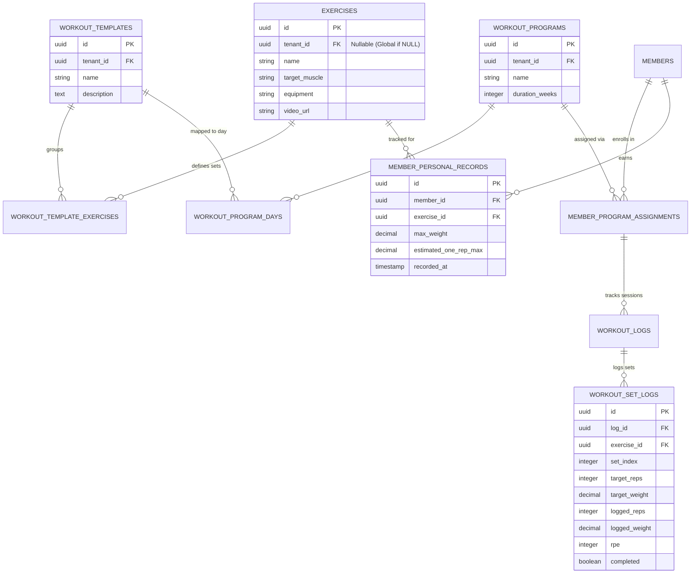

# 10. Workout Module

This document designs the training program builder, exercise catalog, set logging engine, and Personal Record (PR) tracking system.

---

## 1. Database Schema Design

To support exercise configurations, multi-week programs, set logs, and historical PR tables, we define the following tables:



### Table Definitions

#### `public.exercises`
*   `id`: `UUID` (Primary Key, Default: `gen_random_uuid()`)
*   `tenant_id`: `UUID` (Nullable, References `public.tenants(id)`) -- NULL indicates system-provided global exercises.
*   `name`: `VARCHAR(100)` (Not Null)
*   `target_muscle`: `VARCHAR(50)` (Not Null) -- e.g. `'Chest'`, `'Quads'`, `'Hamstrings'`
*   `equipment`: `VARCHAR(50)` -- e.g. `'Barbell'`, `'Dumbbell'`, `'Cables'`
*   `instructions`: `TEXT`
*   `video_url`: `TEXT` -- Supabase Storage CDN reference url

#### `public.workout_templates`
*   `id`: `UUID` (Primary Key, Default: `gen_random_uuid()`)
*   `tenant_id`: `UUID` (Not Null, References `public.tenants(id)`)
*   `name`: `VARCHAR(100)` (Not Null)
*   `description`: `TEXT`

#### `public.workout_template_exercises`
Binds exercises to templates, specifying standard prescription sets.
*   `template_id`: `UUID` (References `public.workout_templates(id)` ON DELETE CASCADE)
*   `exercise_id`: `UUID` (References `public.exercises(id)`)
*   `sequence_order`: `INTEGER` (Not Null)
*   `prescription_sets`: `JSONB` (Not Null) -- Stores target arrays: `[{"reps": 10, "rpe": 8, "restSeconds": 90}]`
*   
    PRIMARY KEY (template_id, exercise_id, sequence_order)

#### `public.workout_programs`
Multi-week training layouts (e.g. "8-Week Hypertrophy Routine").
*   `id`: `UUID` (Primary Key, Default: `gen_random_uuid()`)
*   `tenant_id`: `UUID` (Not Null, References `public.tenants(id)`)
*   `name`: `VARCHAR(100)` (Not Null)
*   `duration_weeks`: `INTEGER` (Not Null CHECK `duration_weeks > 0`)

#### `public.workout_program_days`
Maps templates to weeks and days in a program.
*   `id`: `UUID` (Primary Key, Default: `gen_random_uuid()`)
*   `program_id`: `UUID` (Not Null, References `public.workout_programs(id)` ON DELETE CASCADE)
*   `week_number`: `INTEGER` (Not Null)
*   `day_number`: `INTEGER` (Not Null) -- Day 1, Day 2, Day 3
*   `template_id`: `UUID` (Not Null, References `public.workout_templates(id)`)

#### `public.member_program_assignments`
*   `id`: `UUID` (Primary Key, Default: `gen_random_uuid()`)
*   `member_id`: `UUID` (Not Null, References `public.members(id)` ON DELETE CASCADE)
*   `program_id`: `UUID` (Not Null, References `public.workout_programs(id)`)
*   `start_date`: `DATE` (Not Null)
*   `end_date`: `DATE` (Not Null)
*   `status`: `VARCHAR(20)` (Default: `'ACTIVE'`, Check: `IN ('ACTIVE', 'COMPLETED', 'CANCELLED')`)

#### `public.workout_logs`
Header tracking a single member training session.
*   `id`: `UUID` (Primary Key, Default: `gen_random_uuid()`)
*   `tenant_id`: `UUID` (Not Null, References `public.tenants(id)`)
*   `assignment_id`: `UUID` (References `public.member_program_assignments(id)`)
*   `member_id`: `UUID` (Not Null, References `public.members(id)`)
*   `template_id`: `UUID` (References `public.workout_templates(id)`)
*   `logged_at`: `TIMESTAMP WITH TIME ZONE` (Default: `now()`)
*   `duration_minutes`: `INTEGER`

#### `public.workout_set_logs`
Logs weights and reps completed for each set.
*   `id`: `UUID` (Primary Key, Default: `gen_random_uuid()`)
*   `log_id`: `UUID` (Not Null, References `public.workout_logs(id)` ON DELETE CASCADE)
*   `exercise_id`: `UUID` (Not Null, References `public.exercises(id)`)
*   `set_index`: `INTEGER` (Not Null) -- Set 1, Set 2
*   `target_reps`: `INTEGER`
*   `target_weight`: `NUMERIC(6, 2)`
*   `logged_reps`: `INTEGER` (Not Null)
*   `logged_weight`: `NUMERIC(6, 2)` (Not Null)
*   `rpe`: `INTEGER` (Check: `rpe >= 1 AND rpe <= 10`)
*   `completed`: `BOOLEAN` (Default: `true`)

#### `public.member_personal_records`
Keeps historical records of each member's personal records per exercise.
*   `id`: `UUID` (Primary Key, Default: `gen_random_uuid()`)
*   `member_id`: `UUID` (Not Null, References `public.members(id)` ON DELETE CASCADE)
*   `exercise_id`: `UUID` (Not Null, References `public.exercises(id)`)
*   `set_log_id`: `UUID` (Not Null, References `public.workout_set_logs(id)` ON DELETE CASCADE)
*   `max_weight`: `NUMERIC(6, 2)` (Not Null) -- Max weight lifted for 1 rep
*   `estimated_one_rep_max`: `NUMERIC(6, 2)` (Not Null) -- Calculated 1RM
*   `recorded_at`: `TIMESTAMP WITH TIME ZONE` (Default: `now()`)

---

## 2. Workout Module APIs

### I. Assign Program to Member
`POST /api/v1/workouts/assign`
- **Body**:
  ```json
  {
    "memberId": "uuid",
    "programId": "uuid",
    "startDate": "2026-06-22"
  }
  ```
- **Action**: Creates `member_program_assignments` record. End date is calculated automatically:
  $$\text{End Date} = \text{Start Date} + (\text{Program Duration Weeks} \times 7)$$
- **Response**: `{ "success": true, "assignmentId": "uuid" }`

### II. Log Completed Workout Session (Member App)
`POST /api/v1/workouts/logs`
- **Body**:
  ```json
  {
    "assignmentId": "uuid",
    "templateId": "uuid",
    "durationMinutes": 60,
    "sets": [
      {
        "exerciseId": "uuid",
        "setIndex": 1,
        "loggedReps": 10,
        "loggedWeight": 225.00,
        "rpe": 9
      }
    ]
  }
  ```
- **Action**: Inserts log headers and set details. Executes PostgreSQL trigger to calculate 1RM:
  $$\text{Estimated 1RM} = \text{loggedWeight} \times \left(1 + \frac{\text{loggedReps}}{30}\right)$$
  If the calculated 1RM exceeds the member's current record in `member_personal_records` for that exercise, it upserts the record and returns a PR event flag.
- **Response**: `{ "success": true, "newPersonalRecord": true, "estimatedOneRepMax": 300.00 }`

### III. Get Member PR Dashboard
`GET /api/v1/workouts/members/:memberId/prs`
- **Response**: Returns lists of all exercises with maximum weights and 1RM histories.

---

## 3. Folder Structure Mappings

```
/
├── apps/
│   ├── web/                     # Admin / Trainer Dashboard
│   │   └── src/
│   │       └── features/
│   │           └── workouts/
│   │               ├── components/
│   │               │   ├── ProgramBuilder.tsx      # Multi-week drag-and-drop builder
│   │               │   ├── TemplateSelector.tsx    # Select daily workouts templates
│   │               │   └── ExerciseSelector.tsx    # Exercise library selectors
│   │               └── hooks/
│   │                   └── useExerciseSearch.ts
│   │
│   └── mobile/                  # Member App
│       └── src/
│           └── features/
│               └── workouts/
│                   ├── components/
│                   │   ├── WorkoutLoggerCard.tsx   # Inline logging card
│                   │   └── VideoPreviewModal.tsx   # Pop-up video demo streams
│                   └── screens/
│                       ├── ActiveWorkoutScreen.tsx # Full screen workout timer & logger
│                       └── PrDashboardScreen.tsx   # Personal Records graphs
│
└── supabase/
    └── storage/                 # Supabase Storage configs
        └── exercise-videos/     # CDN Bucket configurations (mp4 format limits, 15MB max)
```
 oily
