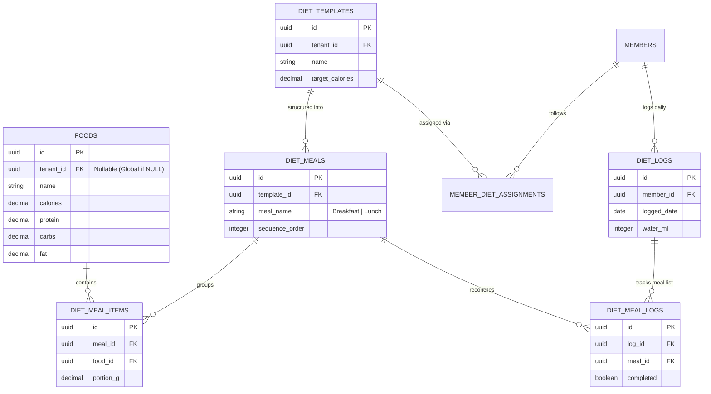

# 11. Diet & Nutrition Module

This document designs the diet template builders, nutrition calculator engines, daily tracking logs, and UI interfaces.

---

## 1. Database Schema Design

To support food catalogs, meal templates, and daily log tracking, we define the following tables:



### Table Definitions

#### `public.foods`
Global USDA/FDC database records combined with custom items added by the gym's trainers.
*   `id`: `UUID` (Primary Key, Default: `gen_random_uuid()`)
*   `tenant_id`: `UUID` (Nullable, References `public.tenants(id)`) -- NULL indicates system-provided global foods.
*   `name`: `VARCHAR(100)` (Not Null)
*   `portion_g`: `NUMERIC(6, 2)` (Not Null, Default: `100.00`) -- Base nutrition measurement size
*   `calories`: `NUMERIC(6, 2)` (Not Null CHECK `calories >= 0`)
*   `protein_g`: `NUMERIC(5, 2)` (Not Null CHECK `protein_g >= 0`)
*   `carbs_g`: `NUMERIC(5, 2)` (Not Null CHECK `carbs_g >= 0`)
*   `fat_g`: `NUMERIC(5, 2)` (Not Null CHECK `fat_g >= 0`)

#### `public.diet_templates`
*   `id`: `UUID` (Primary Key, Default: `gen_random_uuid()`)
*   `tenant_id`: `UUID` (Not Null, References `public.tenants(id)`)
*   `name`: `VARCHAR(100)` (Not Null)
*   `target_calories`: `NUMERIC(6, 2)` (Not Null CHECK `target_calories > 0`)
*   `target_protein_g`: `NUMERIC(5, 2)` (Not Null)
*   `target_carbs_g`: `NUMERIC(5, 2)` (Not Null)
*   `target_fat_g`: `NUMERIC(5, 2)` (Not Null)

#### `public.diet_meals`
Meal subdivisions inside a daily diet template.
*   `id`: `UUID` (Primary Key, Default: `gen_random_uuid()`)
*   `template_id`: `UUID` (Not Null, References `public.diet_templates(id)` ON DELETE CASCADE)
*   `meal_name`: `VARCHAR(50)` (Not Null) -- e.g. `'Breakfast (Post-Workout)'`, `'Mid-day Snack'`
*   `sequence_order`: `INTEGER` (Not Null)

#### `public.diet_meal_items`
Detailed foods mapped inside each meal.
*   `id`: `UUID` (Primary Key, Default: `gen_random_uuid()`)
*   `meal_id`: `UUID` (Not Null, References `public.diet_meals(id)` ON DELETE CASCADE)
*   `food_id`: `UUID` (Not Null, References `public.foods(id)`)
*   `portion_g`: `NUMERIC(6, 2)` (Not Null CHECK `portion_g > 0`)

#### `public.member_diet_assignments`
*   `id`: `UUID` (Primary Key, Default: `gen_random_uuid()`)
*   `member_id`: `UUID` (Not Null, References `public.members(id)` ON DELETE CASCADE)
*   `template_id`: `UUID` (Not Null, References `public.diet_templates(id)`)
*   `start_date`: `DATE` (Not Null)
*   `end_date`: `DATE` (Not Null)
*   `is_active`: `BOOLEAN` (Default: `true`)

#### `public.diet_logs`
Daily tracking header.
*   `id`: `UUID` (Primary Key, Default: `gen_random_uuid()`)
*   `member_id`: `UUID` (Not Null, References `public.members(id)` ON DELETE CASCADE)
*   `logged_date`: `DATE` (Not Null DEFAULT `CURRENT_DATE`)
*   `water_ml`: `INTEGER` (Not Null DEFAULT 0 CHECK `water_ml >= 0`)
*   
    CONSTRAINT unique_member_diet_date UNIQUE (member_id, logged_date)

#### `public.diet_meal_logs`
*   `id`: `UUID` (Primary Key, Default: `gen_random_uuid()`)
*   `log_id`: `UUID` (Not Null, References `public.diet_logs(id)` ON DELETE CASCADE)
*   `meal_id`: `UUID` (Not Null, References `public.diet_meals(id)`)
*   `completed`: `BOOLEAN` (Not Null DEFAULT `false`)

---

## 2. Dynamic Macros Calculator & APIs

### I. Calculate Calories & Macros Targets
`POST /api/v1/diet/calculate-targets`
- **Body**:
  ```json
  {
    "weightKg": 80.00,
    "heightCm": 180,
    "age": 30,
    "gender": "MALE",
    "activityLevel": "MODERATE",
    "goal": "FAT_LOSS"
  }
  ```
- **Calculation Rules**:
  1.  **BMR (Mifflin-St Jeor)**:
      $$\text{BMR} = (10 \times 80) + (6.25 \times 180) - (5 \times 30) + 5 = 1780\text{ kcal}$$
  2.  **TDEE**:
      $$\text{TDEE} = \text{BMR} \times 1.55 \text{ (Moderate Multiplier)} = 2759\text{ kcal}$$
  3.  **Target Calories (Deficit 20%)**:
      $$\text{Target Calories} = 2759 \times 0.8 = 2207\text{ kcal}$$
  4.  **Target Macros Split**:
      - Protein: $2.0\text{g/kg}$ of bodyweight = $160\text{g}$ ($640\text{ kcal}$)
      - Fat: $25\%$ of calories = $551.75\text{ kcal} \div 9\text{g} = 61.3\text{g}$
      - Carbs: Remaining calories = $2207 - 640 - 551.75 = 1015.25\text{ kcal} \div 4\text{g} = 253.8\text{g}$
- **Response**: `{ "calories": 2207, "proteinG": 160, "carbsG": 254, "fatG": 61 }`

### II. Onboard Diet Template
`POST /api/v1/diet/templates`
- **Body**: Custom JSON layout specifying nested array of meals and items.
- **Response**: `{ "success": true, "templateId": "uuid" }`

### III. Log Meal Completion
`POST /api/v1/diet/logs/meals`
- **Body**: `{ "loggedDate": "2026-06-22", "mealId": "uuid", "completed": true }`
- **Response**: `{ "success": true }`

---

## 3. UI Flows & Wireframe Layouts

### I. Trainer's Meal Plan Builder (Web Panel)
- **Left Panel (Food Catalog Search)**:
  - Text input with auto-suggest listing matched items from `public.foods`.
  - Display macronutrient values per $100\text{g}$. Click "Add to Meal" triggers slider for portion selection.
- **Right Panel (Meal Structure Layout)**:
  - Vertical cards representing: `Meal 1 - Breakfast`, `Meal 2 - Lunch`, etc.
  - Drag-and-drop to move items between meal cards.
  - **Dynamic Totals Dashboard (Footer)**: High-contrast bar showing live sums of:
    - Calories ($\text{current} \div \text{target}$)
    - Protein, Carbs, and Fat bars updating in real-time as items are added.

### II. Member's Diet Tracker Screen (Mobile PWA)
- **Top Section**:
  - Horizontal calendar day selector.
  - Concentric progress rings: outer ring displays Calories Consumed vs. Target, nested bars display protein, carbs, and fat percentages.
- **Middle Section (Meal Cards)**:
  - List of meal panels (e.g. "Breakfast - Oats & Whey").
  - Displays target foods list.
  - A checkmark icon next to the meal card. Tapping validates completion state and updates top progress rings.
- **Bottom Section**:
  - **Water Intake Tracker**: Tap-to-add button ($+250\text{ml}$ icon), displaying a cup graphic filling dynamically up to the daily target ($3000\text{ml}$).
