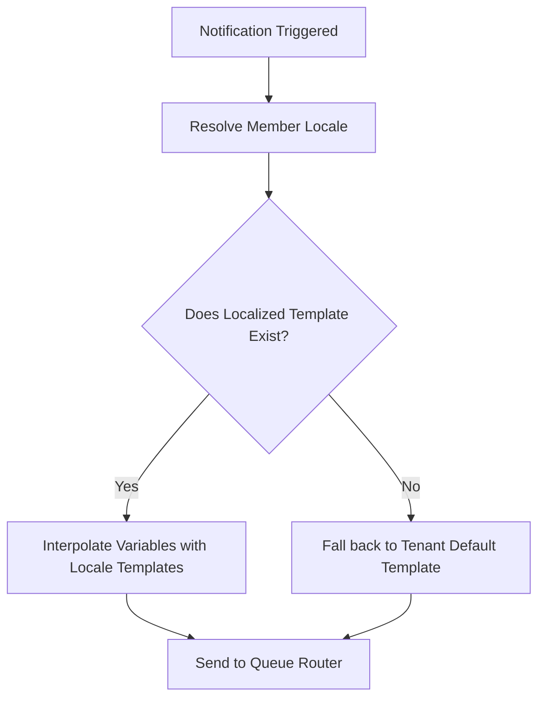
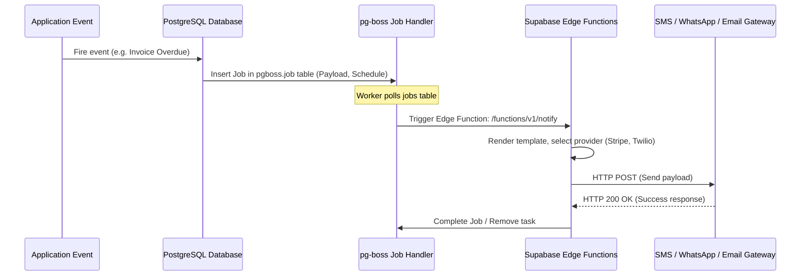
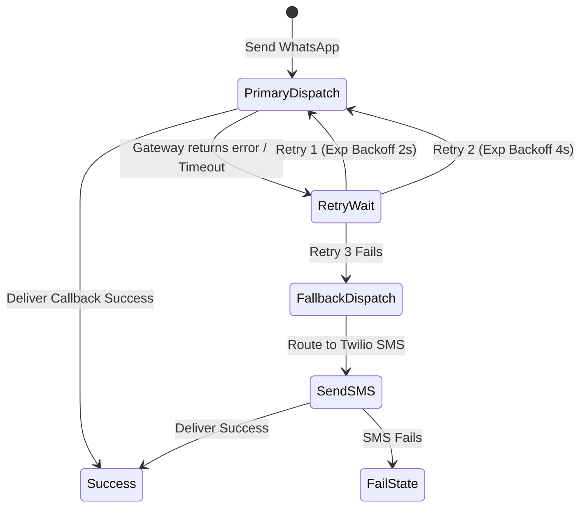

# 12. Notification & Communication Module

This document designs a highly reliable, globally scalable communication engine that routes notifications across channels based on regional user behaviors.

---

## 1. Multi-Lingual Template Engine Architecture

To support local customization across regions, notifications are parsed dynamically based on the member's profile language preference (`members.locale`).



### I. Template Database Schema
```sql
CREATE TABLE public.notification_templates (
    id UUID PRIMARY KEY DEFAULT gen_random_uuid(),
    tenant_id UUID NOT NULL REFERENCES public.tenants(id) ON DELETE CASCADE,
    slug VARCHAR(100) NOT NULL, -- e.g. 'membership_expiring'
    locale VARCHAR(10) NOT NULL, -- e.g. 'en', 'es', 'ar'
    channel VARCHAR(15) NOT NULL CHECK (channel IN ('WHATSAPP', 'SMS', 'EMAIL', 'PUSH')),
    subject_template VARCHAR(255), -- Nullable, used for Email
    body_template TEXT NOT NULL, -- Handlebars variable markup: "Hello {{name}}..."
    
    CONSTRAINT unique_tenant_slug_locale_channel UNIQUE (tenant_id, slug, locale, channel)
);
```

### II. Interpolation Protocol
When rendering template bodies, the engine matches variables passed in the event payload:
- Target fields: `{{firstName}}`, `{{expiryDate}}`, `{{gymName}}`.
- Formatting is locale-aware: Dates are formatted according to the localized schema (e.g. `MM/DD/YYYY` for `en-US`, `DD/MM/YYYY` for `en-GB`, or Arabic digits for `ar`).

---

## 2. Queue Architecture (Supabase Edge + pg-boss)

To absorb massive event spikes (e.g. daily morning subscription checks, mass marketing blasts), we route events through an asynchronous queue built on **pg-boss** (Postgres queue processor) and executed by **Supabase Edge Functions**.



---

## 3. Failover & Retry Mechanism

Network disruptions and gateway outages require structured fallbacks to guarantee receipt of critical notices (invoice alerts, gate suspensions).

### Provider Routing Logic (Regional Defaults)
- **United States & Canada**:
  - Primary Channel: **SMS (Twilio)**
  - Fallback Channel: **Email (Resend)**
- **India, LATAM, European Union**:
  - Primary Channel: **WhatsApp (Meta Cloud API)**
  - Fallback Channel: **SMS (Twilio / localized gateway)**

### State Machine for Failover Delivery

- **Fallback Execution**: If WhatsApp delivery status is not updated to `delivered` via webhook within 4 hours, or the API rejects with a fatal route error, the queue worker automatically generates a fallback job routing the rendered notification as a SMS.

---

## 4. Timezone-Aware Scheduling Engine

To prevent disturbance, promotional and check-in reminders (excluding time-critical security OTPs or checkout receipts) must respect localized member boundaries.

### Quiet Hours Constraint Rules
- **Permissible Window**: 09:00 AM to 08:00 PM (Member Local Time).
- **Execution Workflow**:
  1. The event engine calculates the send time in the member's resolved timezone offset:
     $$\text{Member Local Hour} = \text{UTC Time} \pm \text{Member Timezone Offset}$$
  2. If $\text{Member Local Hour} < 9 \text{ (09:00 AM)}$ or $\text{Member Local Hour} > 20 \text{ (08:00 PM)}$:
     - The scheduler halts instant dispatch.
     - Computes the delay necessary to target the next morning at 10:00 AM local time.
     - Updates the `pgboss.job` configuration `startAfter` timestamp using the calculated offset.
