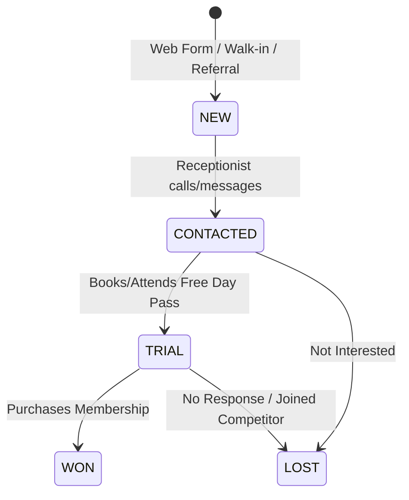

# 13. Lead Module (CRM)

## 1. Lead Capture & Funnel Stages
The Lead module operates as a sales pipeline CRM to capture prospective gym members, schedule trials, and track conversions.



### Lead Attributes
- **Name**: Prospect's name.
- **Contact**: Email & Phone.
- **Source**: Where the lead originated (Facebook Ads, Google Maps, Walk-in, Referral, Website Form).
- **Status (Funnel Stage)**: `NEW`, `CONTACTED`, `TRIAL`, `WON`, `LOST`.
- **Assigned Staff**: The sales rep/receptionist responsible for the prospect.
- **Last Interaction & Notes**: Log of phone calls, messages, or tours.

---

## 2. Follow-Up Task Scheduler
To prevent prospects from falling through the cracks:
- System enables admins to schedule a follow-up date (`next_follow_up`).
- **Cron Jobs**: Run every morning (08:00 AM tenant local time) to select all leads with `next_follow_up` set to the current day.
- **Task Notifications**: Sends in-app push alerts or emails to the assigned staff member containing the prospect lists for the day.

---

## 3. Public Capture Form API (Widgets)
The system provides a public script/widget for gym websites.
- **Widget Setup**: Gym includes a `<script>` tag pointing to `https://widgets.gymsaas.com/lead-form.js`.
- **Auth Key**: Uses a public-facing API key (`x-tenant-public-key`) that is rate-limited by IP to prevent spam submissions.

---

## 4. Key API Endpoints

### Capture Public Lead (Website Form Integration)
`POST /api/v1/leads/public`
*   **Headers**: `x-tenant-public-key: pub_live_xyz`
*   **Body**:
    ```json
    {
      "name": "Sarah Connor",
      "email": "sarah@cyberdyne.com",
      "phone": "+15551984",
      "source": "Website Form",
      "notes": "Interested in private martial arts classes."
    }
    ```
*   **Response**: `{ "success": true, "message": "Thank you! We will contact you shortly." }`

### Get CRM Pipeline Leads (Staff Auth Required)
`GET /api/v1/leads`
*   **Query Params**: `stage`, `source`, `assignedTo`
*   **Response**:
    ```json
    {
      "leads": [
        {
          "id": "lead-uuid",
          "name": "Sarah Connor",
          "status": "NEW",
          "nextFollowUp": "2026-06-25T10:00:00Z"
        }
      ]
    }
    ```

### Update Lead Stage / Notes
`PUT /api/v1/leads/:id`
*   **Body**:
    ```json
    {
      "status": "CONTACTED",
      "notes": "Called twice, booked a free trial for Friday at 6 PM.",
      "nextFollowUp": "2026-06-27T18:00:00Z"
    }
    ```
*   **Response**: `{ "success": true }`
