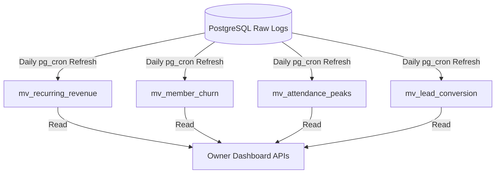

# 14. Analytics Module

This document designs the analytics aggregation architecture, materialized views, dashboard payloads, and database reporting metrics.

---

## 1. Materialized Views Design

To enable fast response times on owner dashboards, we pre-aggregate metrics into PostgreSQL materialized views. These views are refreshed concurrently during off-peak hours.



### I. Monthly Recurring Revenue (MRR) Materialized View
Normalizes all active memberships into a monthly billing metric.
```sql
CREATE MATERIALIZED VIEW public.mv_recurring_revenue AS
SELECT 
    m.tenant_id,
    date_trunc('month', m.start_date)::date AS billing_month,
    SUM(
        (mp.price * 30.0) / mp.duration_days
    ) AS calculated_mrr,
    COUNT(m.id) AS active_subscriptions_count
FROM 
    public.member_memberships m
JOIN 
    public.membership_plans mp ON m.plan_id = mp.id
WHERE 
    m.status = 'ACTIVE' 
    AND m.deleted_at IS NULL
    AND m.end_date >= CURRENT_DATE
GROUP BY 
    m.tenant_id, 
    billing_month;

CREATE UNIQUE INDEX idx_mv_mrr_tenant_month ON public.mv_recurring_revenue (tenant_id, billing_month);
```

### II. Member Churn Materialized View
Tracks member churn rates over rolling 30-day windows.
```sql
CREATE MATERIALIZED VIEW public.mv_member_churn AS
SELECT 
    tenant_id,
    date_trunc('month', recorded_date)::date AS churn_month,
    COUNT(CASE WHEN status = 'EXPIRED' THEN 1 END)::numeric / 
    NULLIF(COUNT(CASE WHEN status = 'ACTIVE' THEN 1 END), 0)::numeric * 100 AS churn_rate_pct,
    COUNT(CASE WHEN status = 'EXPIRED' THEN 1 END) AS churned_members_count
FROM (
    SELECT 
        tenant_id,
        member_id,
        status,
        end_date AS recorded_date
    FROM 
        public.member_memberships
) sub
GROUP BY 
    tenant_id, 
    churn_month;

CREATE UNIQUE INDEX idx_mv_churn_tenant_month ON public.mv_member_churn (tenant_id, churn_month);
```

### III. Busiest Hours Attendance Materialized View
Computes average check-in spikes grouped by hour of the day.
```sql
CREATE MATERIALIZED VIEW public.mv_attendance_peaks AS
SELECT 
    tenant_id,
    EXTRACT(DOW FROM check_in) AS day_of_week, -- 0 (Sunday) to 6 (Saturday)
    EXTRACT(HOUR FROM check_in) AS checkin_hour,
    COUNT(id) AS total_scans_count,
    ROUND(AVG(COUNT(id)) OVER (PARTITION BY tenant_id, EXTRACT(DOW FROM check_in))) AS average_checkins
FROM 
    public.attendance
GROUP BY 
    tenant_id, 
    day_of_week, 
    checkin_hour;

CREATE UNIQUE INDEX idx_mv_attendance_peaks ON public.mv_attendance_peaks (tenant_id, day_of_week, checkin_hour);
```

### IV. Lead Conversion Funnel Materialized View
```sql
CREATE MATERIALIZED VIEW public.mv_lead_conversion AS
SELECT 
    tenant_id,
    source,
    COUNT(id) AS total_leads,
    COUNT(CASE WHEN status = 'WON' THEN 1 END) AS converted_leads,
    COUNT(CASE WHEN status = 'LOST' THEN 1 END) AS closed_lost_leads,
    ROUND(
        (COUNT(CASE WHEN status = 'WON' THEN 1 END)::numeric / 
         NULLIF(COUNT(id), 0)::numeric) * 100, 2
    ) AS conversion_rate_pct
FROM 
    public.leads
GROUP BY 
    tenant_id, 
    source;

CREATE UNIQUE INDEX idx_mv_leads_conversion ON public.mv_lead_conversion (tenant_id, source);
```

---

## 2. Aggregations & Dashboard Refresh Strategy

To ensure database queries do not run into locking conflicts:
- **Refresh Frequency**: Materialized views are refreshed concurrently every morning at 02:00 AM (tenant local time) using **`pg_cron`**:
  ```sql
  SELECT cron.schedule('refresh-analytics-views', '0 2 * * *', 'REFRESH MATERIALIZED VIEW CONCURRENTLY public.mv_recurring_revenue;');
  ```
- **Real-time Snapshots**: A lightweight analytics table `public.daily_financial_reports` tracks real-time cash flow (writes are appended instantly upon successful webhook transaction returns).

---

## 3. Dashboard API Schemas (JSON Contracts)

All data structures conform to chart library requirements (e.g. Recharts).

### I. Financial Dashboard Payload
`GET /api/v1/analytics/financial-dashboard`
```json
{
  "tenantId": "tenant-uuid",
  "currency": "USD",
  "summary": {
    "currentMRR": 18500.00,
    "mrrGrowthPct": 8.4,
    "rolling30DayChurnRate": 3.2,
    "activeSubscriptions": 320
  },
  "mrrHistory": [
    { "month": "2026-01-01", "mrr": 15200.00, "activeMembers": 290 },
    { "month": "2026-02-01", "mrr": 16100.00, "activeMembers": 302 },
    { "month": "2026-03-01", "mrr": 18500.00, "activeMembers": 320 }
  ]
}
```

### II. Operations Dashboard Payload (Attendance & CRM Leads)
`GET /api/v1/analytics/operations-dashboard`
```json
{
  "attendanceSummary": {
    "busiestDay": "Monday",
    "busiestHour": 18,
    "averageDailyVisits": 145
  },
  "leadFunnel": [
    { "source": "Facebook Ads", "leadsCount": 150, "conversionRate": 12.5 },
    { "source": "Google Search", "leadsCount": 85, "conversionRate": 18.2 },
    { "source": "Referrals", "leadsCount": 40, "conversionRate": 45.0 }
  ]
}
```

### III. Cohort Retention Table Payload
`GET /api/v1/analytics/retention-cohorts`
Tracks member retention percentages month-over-month:
```json
{
  "cohorts": [
    {
      "cohortMonth": "Jan 2026",
      "startingMembersCount": 100,
      "retentionPercentageByMonth": [100.0, 95.0, 92.0, 88.0]
    },
    {
      "cohortMonth": "Feb 2026",
      "startingMembersCount": 120,
      "retentionPercentageByMonth": [100.0, 97.5, 93.0]
    }
  ]
}
```
 oily
