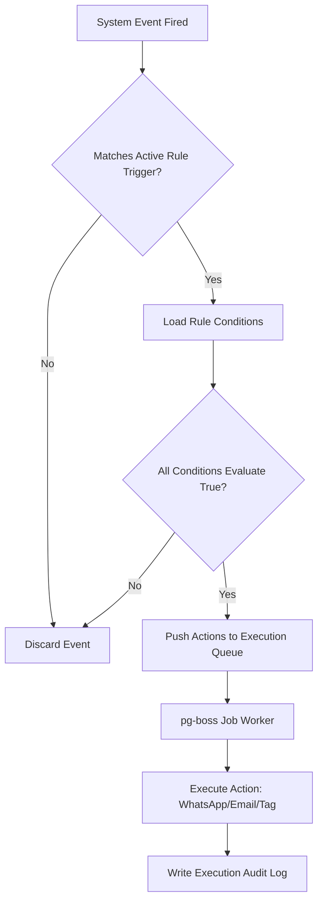
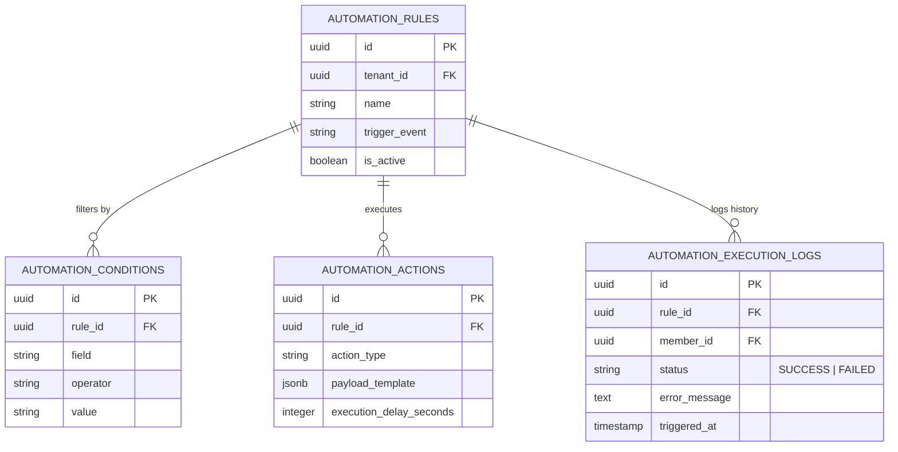

# 15. Automation Module

This document designs a no-code automation builder using a flexible Trigger-Condition-Action (TCA) engine, detailing schemas, evaluation logic, and execution flows.

---

## 1. Trigger-Condition-Action (TCA) Rule Engine

The engine parses structural rule definitions to automate workflows (e.g. billing alerts, follow-ups, and checks).



### Engine Components

#### I. Triggers (Events)
- `MEMBERSHIP_EXPIRATION_APPROACHING` (Fires $N$ days before `membership.end_date`)
- `PAYMENT_FAILED` (Fires immediately upon gateway webhook callback failure)
- `MEMBER_ABSENT_DURATION` (Fires when a member has not checked in for $N$ days)
- `MEMBER_CHECKIN` (Fires immediately after gate check success)

#### II. Conditions (Filters)
Evaluates dynamic state properties using comparative operators:
- Operators: `EQUALS`, `NOT_EQUALS`, `GREATER_THAN`, `LESS_THAN`, `IN_ARRAY`.
- Target fields: `member.status`, `membership_plan.id`, `member.gender`, `invoice.balance_due`.

#### III. Actions
- `SEND_WHATSAPP` (Meta Cloud API call)
- `SEND_EMAIL` (Resend API call)
- `ADD_TAG` / `REMOVE_TAG` (Database modifier)
- `SUSPEND_MEMBER` (Gate lockout modifier)

---

## 2. Database Schema Design

To support custom workflow rules and keep audit trails of executed alerts, we define the following tables:



### Table Definitions

#### `public.automation_rules`
*   `id`: `UUID` (Primary Key, Default: `gen_random_uuid()`)
*   `tenant_id`: `UUID` (Not Null, References `public.tenants(id)` ON DELETE CASCADE)
*   `name`: `VARCHAR(150)` (Not Null)
*   `trigger_event`: `VARCHAR(100)` (Not Null) -- e.g. `'MEMBERSHIP_EXPIRATION_APPROACHING'`
*   `is_active`: `BOOLEAN` (Default: `true`)

#### `public.automation_conditions`
*   `id`: `UUID` (Primary Key, Default: `gen_random_uuid()`)
*   `rule_id`: `UUID` (Not Null, References `public.automation_rules(id)` ON DELETE CASCADE)
*   `field`: `VARCHAR(100)` (Not Null) -- e.g. `'member.status'`
*   `operator`: `VARCHAR(20)` (Not Null) -- Check: `IN ('EQUALS', 'NOT_EQUALS', 'GREATER_THAN', 'LESS_THAN', 'IN_ARRAY')`
*   `value`: `VARCHAR(255)` (Not Null) -- Raw evaluation target

#### `public.automation_actions`
*   `id`: `UUID` (Primary Key, Default: `gen_random_uuid()`)
*   `rule_id`: `UUID` (Not Null, References `public.automation_rules(id)` ON DELETE CASCADE)
*   `action_type`: `VARCHAR(50)` (Not Null) -- Check: `IN ('SEND_WHATSAPP', 'SEND_EMAIL', 'ADD_TAG', 'SUSPEND_MEMBER')`
*   `payload_template`: `JSONB` (Not Null) -- Templates mapping e.g. `{"templateSlug": "miss_you", "channel": "WhatsApp"}`
*   `execution_delay_seconds`: `INTEGER` (Default: `0` CHECK `execution_delay_seconds >= 0`) -- For delayed follow-ups

#### `public.automation_execution_logs`
*   `id`: `UUID` (Primary Key, Default: `gen_random_uuid()`)
*   `tenant_id`: `UUID` (Not Null, References `public.tenants(id)`)
*   `rule_id`: `UUID` (Not Null, References `public.automation_rules(id)`)
*   `member_id`: `UUID` (Not Null, References `public.members(id)` ON DELETE CASCADE)
*   `triggered_at`: `TIMESTAMP WITH TIME ZONE` (Default: `now()`)
*   `status`: `VARCHAR(15)` (Not Null CHECK `status IN ('SUCCESS', 'FAILED')`)
*   `error_message`: `TEXT`

---

## 3. Asynchronous Execution Flow & Exception Handling

### Dynamic Variable Evaluation Example
Let's parse a rule: **"IF membership expires in 7 days, THEN send WhatsApp."**

1.  **Cron Event Trigger**: Daily at 08:00 AM, a background scheduler runs:
    - Finds active rules with trigger `MEMBERSHIP_EXPIRATION_APPROACHING`.
    - Queries the database for memberships ending exactly in 7 days:
      $$\text{Expiration Date} = \text{Current Date} + 7\text{ days}$$
2.  **Evaluate Conditions**: For each matched member, the rule evaluator checks the conditions linked to that rule. E.g., `member.status EQUALS ACTIVE`.
3.  **Job Enqueue**: If verified, a payload is compiled:
    ```json
    {
      "ruleId": "rule-uuid",
      "memberId": "member-uuid",
      "actionType": "SEND_WHATSAPP",
      "payload": {
        "phone": "+919988...",
        "templateSlug": "expiry_7day_warning",
        "variables": { "name": "Raj", "days": "7" }
      }
    }
    ```
    This is pushed to the `pg-boss` queue with a delay offset matching the member's timezone quiet hours preferences.
4.  **Worker Execution & Handlers**:
    - The worker pops the job and triggers the Meta Cloud API.
    - **Success**: Status written to `automation_execution_logs` as `'SUCCESS'`.
    - **Failure**: If API rejects (network fail, block list), the job retries up to 3 times with exponential backoff.
    - If all retries fail, it updates log status to `'FAILED'` and saves the error payload. If a tenant's rules fail continuously (failure rate > 10% in 24 hours), the rule `is_active` toggle is disabled automatically, and a dashboard alert notifies the Gym Owner.
