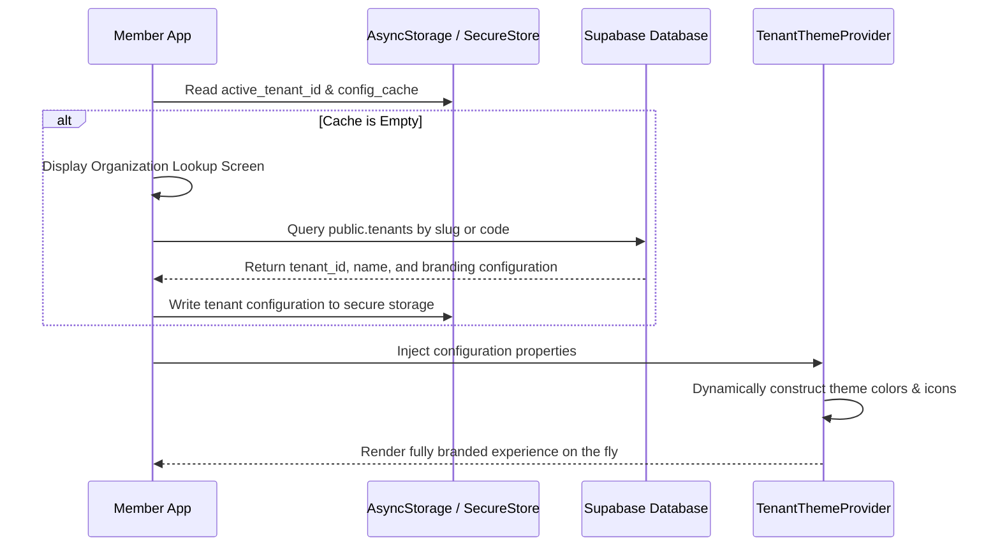
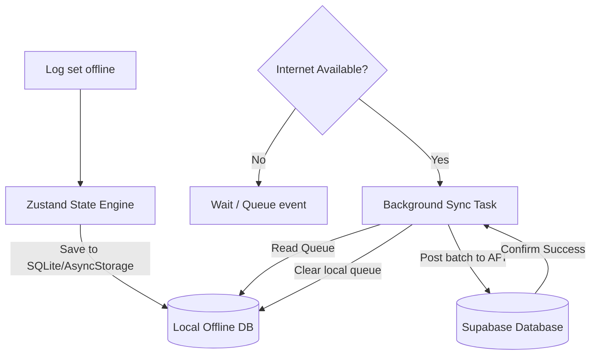

# 16. Member App Specification (React Native Expo Master App)

This document designs the React Native (Expo optimized) single Master App wrapper, detailing runtime tenant resolution, navigation, screen wireframes, mobile APIs, and offline state management.

---

## 1. Dynamic Runtime Tenant Resolution (Master App Wrapper)

The application is published to the stores as a single binary. It dynamically loads gym assets, localization keys, and themes at runtime based on user login context.



### Dynamic Asset Resolutions
On lookup validation, the app loads:
- **Primary Colors**: Mapped to native UI components (buttons, headers, sliders).
- **Fonts**: Pre-loaded dynamically using Expo's font loader engine.
- **Splash Screens & Logos**: Rendered from Cloudflare CDN URLs.

---

## 2. Navigation Architecture & Deep-Linking

The app utilizes **React Navigation** (v6+) split into three distinct routing stacks.

```
AppContainer
├── AuthStack (Rendered if session is null or tenant_id unresolved)
│   ├── OrgLookupScreen
│   ├── LoginScreen
│   └── PasswordResetScreen
│
└── AppDrawerStack (Main navigation drawer)
    ├── TabNavigator (Primary Bottom Tabs)
    │   ├── HomeTab (Dashboard & Active Plan summary)
    │   ├── WorkoutTab (Exercise logs & PR lists)
    │   ├── DietTab (Macronutrients & Water log)
    │   ├── ChallengesTab (Active gym contests & Leaderboards)
    │   └── ProfileTab (Billing history, Invoice downloads)
    │
    └── ScreenModals
        ├── QrCheckinModal (Dynamic security check-in)
        └── ReferralScreen (Referral code shares & Reward trackers)
```

### Deep-Linking Schema
- URL Scheme: `gymsaas://[tenant_slug]`
- Dynamic Paths:
  - `gymsaas://[tenant_slug]/challenges/:id` (Direct routing to join a specific gym challenge)
  - `gymsaas://[tenant_slug]/workouts/active` (Direct routing to resume active workout logging)

---

## 3. Screen Layouts & Features

### I. Home Dashboard (HomeTab)
- **Header**: Brand logo (left), notification bell (right).
- **Active Membership Status Card**: Card background styled using `secondary_color`. Displays plan details and days remaining. Includes an "Extend" or "Freeze" action button.
- **Dynamic Check-in Shortcut**: Large action button triggering the `QrCheckinModal`.
- **Active Challenges Preview**: Horizontal scroll container showing progress bars for ongoing challenges.

### II. Dynamic QR Check-in (QrCheckinModal)
- Full-screen modal with dark background.
- Renders the dynamic 15-second time-bound HMAC security QR code.
- Forces maximum device screen brightness while open to ensure high scanner readability.

### III. Workout & PR Logger (WorkoutTab)
- **Active Routine Panel**: Lists sets, reps, and weights. Features check circles next to each set.
- **PR Tracker Widget**: Tapping an exercise icon displays maximum estimated 1RM stats.
- **Video player**: Embedded mini video player streaming instruction clips from Supabase Storage.

### IV. Nutrition & Water Tracker (DietTab)
- Three vertical progress bars showing Protein, Carbs, and Fat limits.
- Meal catalog showing breakfasts, dinners, and snacks. Members tap a checkbox to log meal compliance.
- **Water Cup Graphic**: Daily tracker progress indicator updating as members log intake.

### V. Gym Challenges & Leaderboard (ChallengesTab)
- **Active Challenges list**: Cards showing details (e.g. "100k Steps in July", "30 Check-ins in 30 Days"). Displays progress percentage.
- **Leaderboard Screen**: Renders member names, check-in count / points, and global position rankings. The member's own rank is pinned to the bottom.

### VI. Referrals & Rewards Screen
- **Share Box**: Displays copyable unique referral code (e.g. `GOLD-ALEX-99`). Includes native sharing sheets triggers.
- **Referral Tracker Grid**: Cards displaying pending and completed referrals, and discount coupons earned.

---

## 4. Mobile APIs

### I. Join Gym Challenge
`POST /api/v1/challenges/:id/join`
- **Response**: `{ "success": true, "status": "JOINED" }`

### II. Fetch Leaderboard
`GET /api/v1/challenges/:id/leaderboard`
- **Response**:
  ```json
  {
    "challengeName": "30-Day Check-in Blast",
    "leaderboard": [
      { "rank": 1, "name": "John Connor", "score": 28, "isSelf": false },
      { "rank": 12, "name": "Sarah Connor", "score": 15, "isSelf": true }
    ]
  }
  ```

### III. Generate Referral Code
`POST /api/v1/referrals/generate`
- **Response**: `{ "referralCode": "APEX-SARAH-22" }`

---

## 5. Offline State Management & Sync

The app handles offline caching and updates using **Zustand** + **AsyncStorage** (or SecureStore for tokens):



- **Token Storage**: Auth tokens (JWT) are stored in secure hardware-backed storage (`expo-secure-store`).
- **Offline Operations**: Daily workouts, diet plans, and check-in tokens are cached locally. If the user completes sets while offline, the app writes actions to an offline queue in storage.
- **Background Sync**: An Expo background sync task listens to connection status changes. When internet connectivity returns, it performs batch operations to upload the queued logs.
