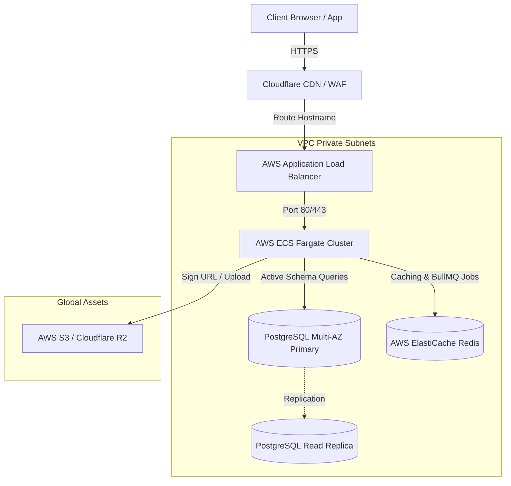

# 18. Deployment & Infrastructure

## 1. Network & Deployment Topology
The SaaS infrastructure is deployed on **AWS (Amazon Web Services)** using a secure VPC multi-AZ (Availability Zone) setup.



---

## 2. CI/CD Pipeline (GitHub Actions Spec)
The pipeline builds, tests, and deploys containers to ECS:

```yaml
name: Deploy Production API

on:
  push:
    branches: [ main ]

jobs:
  build-and-test:
    runs-on: ubuntu-latest
    steps:
      - uses: actions/checkout@v3
      - name: Setup Node
        uses: actions/setup-node@v3
        with:
          node-version: 20
          cache: 'npm'
      - run: npm ci
      - run: npm run lint
      - run: npm run test:cov
      
  deploy:
    needs: build-and-test
    runs-on: ubuntu-latest
    steps:
      - name: Configure AWS Credentials
        uses: aws-actions/configure-aws-credentials@v1
        with:
          aws-access-key-id: ${{ secrets.AWS_ACCESS_KEY_ID }}
          aws-secret-access-key: ${{ secrets.AWS_SECRET_ACCESS_KEY }}
          aws-region: us-east-1
      - name: Login to Amazon ECR
        id: login-ecr
        uses: aws-actions/amazon-ecr-login@v1
      - name: Build & Push Docker Image
        run: |
          docker build -t ${{ steps.login-ecr.outputs.registry }}/gymsaas-api:latest .
          docker push ${{ steps.login-ecr.outputs.registry }}/gymsaas-api:latest
      - name: Deploy Amazon ECS Task
        uses: aws-actions/amazon-ecs-deploy-task-definition@v1
        with:
          task-definition: task-def.json
          service: gymsaas-api-service
          cluster: gymsaas-prod-cluster
```

---

## 3. Database Backups & Recovery (RPO/RTO)
- **Recovery Point Objective (RPO)**: Max 1 hour of data loss.
- **Recovery Time Objective (RTO)**: Sub-30 minutes service restoration.
- **Backup Architecture**:
  - PostgreSQL RDS automatic backups enabled with **7-day PITR (Point-in-Time Recovery)**.
  - Daily full database logical dumps (`pg_dump`) exported to a separate AWS S3 storage bucket configured with write-once-read-many (WORM) Object Lock policy to prevent ransomware deletion.

---

## 4. Monitoring, Health Checks & Log Aggregation
- **API Health Check**: `/health` endpoint returns `200 OK` only if Postgres connection is active and Redis ping responds in under 10ms.
- **Error Tracking**: Sentry SDK integrated into frontend and backend to capture runtime uncaught exceptions.
- **Log Collection**: Container logs stream directly to CloudWatch/Grafana Loki via the AWS FluentBit logger driver.
- **Alerting**: Metrics warnings (e.g., CPU/Memory > 80% for 5 mins, database storage capacity warnings) trigger high-priority alerts via PagerDuty/Slack webhooks.
