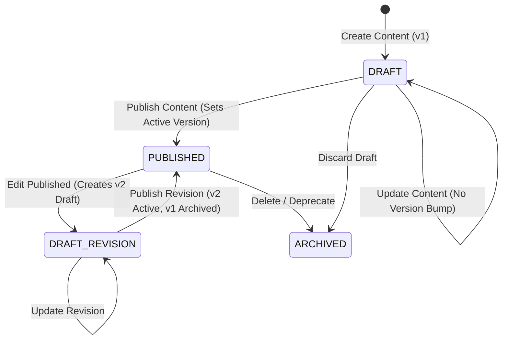
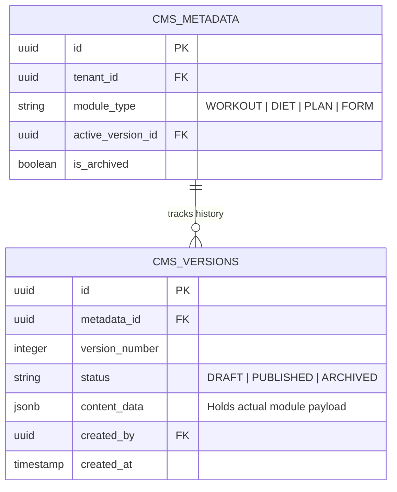
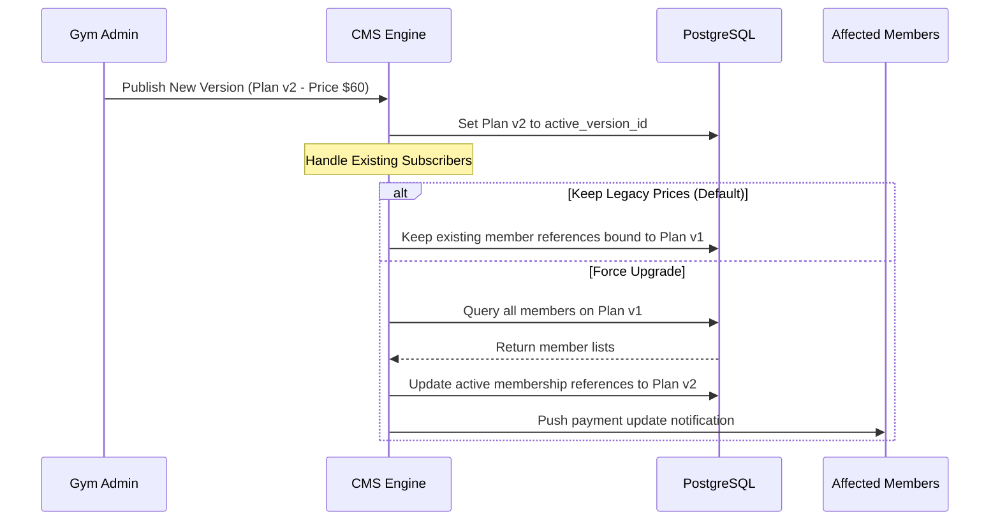

# 19. CMS Module & Versioning Framework

This document designs a unified Content Management System (CMS) framework that governs content creation, versioning, drafting, and publishing workflows.

---

## 1. CMS Core Architecture

The CMS provides a unified workflow across 7 functional sub-modules:
1.  **Exercises**: Workout catalog entries.
2.  **Workouts**: Structured routines.
3.  **Diets**: Nutritional plans.
4.  **Membership Plans**: Gym subscriptions.
5.  **Notification Templates**: Communication layouts.
6.  **Forms**: CRM lead capture layouts.
7.  **Promotions**: Active discounts, campaign offers.



---

## 2. Versioning & Draft Database Schema

To prevent breaking existing member assignments (e.g. if a trainer edits a workout template, members currently following it must not have their active logs altered), we separate current active rows from drafts and version history.



### Table Definitions

#### `public.cms_metadata`
Maintains the root pointer and mapping context for each piece of content.
*   `id`: `UUID` (Primary Key, Default: `gen_random_uuid()`)
*   `tenant_id`: `UUID` (Not Null, References `public.tenants(id)` ON DELETE CASCADE)
*   `module_type`: `VARCHAR(30)` (Check: `IN ('EXERCISE', 'WORKOUT', 'DIET', 'PLAN', 'NOTIFICATION', 'FORM', 'PROMOTION')`)
*   `active_version_id`: `UUID` (Nullable, References `public.cms_versions(id)`)
*   `is_archived`: `BOOLEAN` (Default: `false`)

#### `public.cms_versions`
Stores the actual content payload for each revision.
*   `id`: `UUID` (Primary Key, Default: `gen_random_uuid()`)
*   `metadata_id`: `UUID` (Not Null, References `public.cms_metadata(id)` ON DELETE CASCADE)
*   `version_number`: `INTEGER` (Not Null CHECK `version_number > 0`)
*   `status`: `VARCHAR(15)` (Default: `'DRAFT'`, Check: `IN ('DRAFT', 'PUBLISHED', 'ARCHIVED')`)
*   `content_data`: `JSONB` (Not Null) - Stores the specific module payload (e.g., exercise list, form elements, discount codes).
*   `created_by`: `UUID` (References `auth.users`)
*   `created_at`: `TIMESTAMP WITH TIME ZONE` (Default: `now()`)

---

## 3. Permissions Matrix

Editing permissions are enforced at the module layer:

| CMS Category | Platform Admin | Gym Owner | Manager | Trainer | Receptionist |
| :--- | :---: | :---: | :---: | :---: | :---: |
| **Membership Plans** | No | Owner | Write | No | No |
| **Exercises & Routines**| No | Owner | Write | Write | No |
| **Diet Plans** | No | Owner | Write | Write | No |
| **Notification Templates**| No | Owner | Write | No | No |
| **Lead Forms** | No | Owner | Write | No | No |
| **Promotions & Coupons**| No | Owner | Write | No | No |

*   **Owner**: Full write, read, publish, and delete capability.
*   **Write**: Can create/edit drafts and submit for approval, but cannot publish directly (unless auto-publish rules apply).
*   **None**: Read-only or completely hidden.

---

## 4. CMS API Mappings

All endpoints require authorization context headers.

### I. Create Draft
`POST /api/v1/cms/content`
- **Body**:
  ```json
  {
    "moduleType": "WORKOUT",
    "contentData": {
      "name": "5x5 Strength Program",
      "exercises": [...]
    }
  }
  ```
- **Response**: `{ "success": true, "metadataId": "uuid", "versionId": "uuid", "version": 1 }`

### II. Edit Content (Updates Draft or Creates New Revision)
`PUT /api/v1/cms/content/:metadataId`
- **Action**: Checks if a `DRAFT` version already exists for the target metadata.
  - If a draft exists: Updates `content_data` in place.
  - If only `PUBLISHED` exists: Inserts a new row in `cms_versions` with `status = 'DRAFT'` and `version_number = (active_version_number + 1)`.
- **Response**: `{ "success": true, "versionId": "uuid", "version": 2, "status": "DRAFT" }`

### III. Publish Content
`POST /api/v1/cms/content/:versionId/publish`
- **Action**: Executed inside a SQL transaction:
  1. Sets the previous published version's status to `ARCHIVED`.
  2. Sets the target version's status to `PUBLISHED`.
  3. Updates `cms_metadata.active_version_id` to target `versionId`.
- **Response**: `{ "success": true }`

### IV. Get Content History
`GET /api/v1/cms/content/:metadataId/history`
- **Response**: Returns lists of all version numbers, status tags, author timestamps, and content payloads.

---

## 5. Draft and Publish Active Migration Engine

When content updates (e.g. a gym modifies their "Premium Membership Plan" price or rules):


- **Exercise / Workout Updates**: Members currently assigned to `v1` of a workout routine continue on `v1` until their current assignment cycle ends, or the trainer manually hits "Re-sync to Latest version."
- **Membership Plan Price Changes**: New sign-ups receive `v2` (published). Existing active subscribers remain locked at `v1` pricing to prevent billing policy breaches.
