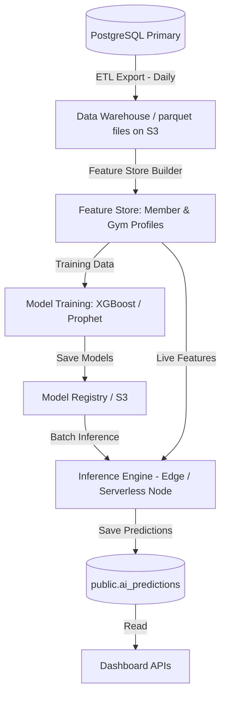

# 20. AI Insights Module

This document designs the machine learning (ML) data pipeline, feature engineering parameters, and model architectures for gym metrics.

---

## 1. Machine Learning Data Pipeline

To support scalable and cost-effective AI features without overloading primary transactional databases:



### Pipeline Execution Schedule
1.  **ETL Phase**: Every night at 03:00 AM (off-peak), a scheduler extracts attendance logs, billing ledger transactions, and member profiles, saving them in columnar format (Parquet) on Supabase Storage (S3 API).
2.  **Inference Phase**: The batch inference engine loads the saved models and features, computes predictions, and writes output to `public.ai_predictions` in the tenant database schema.

---

## 2. Feature Engineering Matrix

To predict churn, member risk, and gym health, raw logs are processed into analytical features:

### I. Member-Level Features (Target: Churn & Member Risk Score)
- **`days_since_last_checkin`**:
  $$\text{Days} = \text{Date}_{\text{today}} - \text{Date}_{\text{last\_checkin}}$$
- **`checkin_velocity`**: Ratio of average check-ins in the last 7 days compared to the last 30 days:
  $$\text{Velocity} = \frac{\text{Avg Check-ins (7d)}}{\text{Avg Check-ins (30d)}}$$
  A drop below $0.5$ indicates a major decline in gym attendance.
- **`payment_delay_average`**: Average number of days between invoice generation and payment settlement.
- **`freeze_count_30d`**: Frequency of membership freezes requested in the last month.

### II. Gym-Level Features (Target: Revenue Forecast & Gym Health)
- **`member_churn_30d`**: Monthly churn rate percentage.
- **`mrr_growth_rate`**: Month-over-month MRR change.
- **`capacity_utilization_ratio`**: Ratio of total check-ins to gym maximum safety capacity during peak hours.

---

## 3. Model Architectures & Methodologies

### I. Churn Prediction & Member Risk Score
- **Objective**: Binary classification (Predict if member will churn within the next 30 days: `0 = Stay, 1 = Churn`) and assign a probability score ($0.0$ to $1.0$).
- **Algorithm**: **XGBoost Classifier** or **Random Forest**. These handle structured tabular data efficiently.
- **Output Mapped to Risk**:
  - Probability $< 0.3$: **Low Risk**
  - Probability $0.3 \text{ to } 0.7$: **Medium Risk**
  - Probability $> 0.7$: **High Risk** (Triggers automated re-engagement WhatsApp alerts)

### II. Revenue Forecasting
- **Objective**: Time-series forecasting to predict MRR for the next 6 months.
- **Algorithm**: **Facebook Prophet** or **SARIMAX**. These model seasonality (e.g., gym sign-up spikes in January, declines in summer) and trends.
- **Confidence Intervals**: 80% and 95% confidence intervals are returned to display best-case and worst-case cash flow estimates.

### III. Occupancy Prediction
- **Objective**: Predict check-in volume hourly for the upcoming week.
- **Algorithm**: **Gradient Boosted Regression Trees (LightGBM)**.
- **Features**: Day of week, hour of day, historical average occupancy, weather inputs, and holidays.

### IV. Gym Health Score
- **Objective**: Provide an overall health score (0-100) to help owners monitor business performance.
- **Formula**:
  $$\text{Health Score} = 0.35 \times \text{Retention Rate} + 0.30 \times \text{MRR Growth} + 0.20 \times \text{Lead Conversion} + 0.15 \times \text{Capacity Utilization}$$
- **Color Coding**:
  - Score $\ge 80$: **Excellent** (Green)
  - Score $50 \text{ to } 79$: **Stable** (Amber)
  - Score $< 50$: **At Risk** (Red)

---

## 4. AI Insights Database Schema

Predictions are stored in `public.ai_predictions` for dashboard retrieval:

```sql
CREATE TABLE public.ai_predictions (
    id UUID PRIMARY KEY DEFAULT gen_random_uuid(),
    tenant_id UUID NOT NULL REFERENCES public.tenants(id) ON DELETE CASCADE,
    target_type VARCHAR(30) NOT NULL CHECK (target_type IN ('MEMBER_CHURN', 'REVENUE_FORECAST', 'OCCUPANCY')),
    target_id UUID, -- References member_id (for churn), NULL for global metrics
    prediction_value JSONB NOT NULL, -- Holds metrics: {"risk_score": 0.85} or {"forecasted_mrr": 15000}
    confidence_score NUMERIC(4,3) CHECK (confidence_score >= 0.0 AND confidence_score <= 1.0),
    predicted_at TIMESTAMP WITH TIME ZONE NOT NULL DEFAULT now()
);

-- Index for fast user/tenant lookups
CREATE INDEX idx_ai_predictions_tenant_target ON public.ai_predictions (tenant_id, target_type, target_id);
```

### Sample Prediction JSON Payload
`GET /api/v1/analytics/member-risk-alerts`
```json
{
  "alerts": [
    {
      "memberId": "uuid",
      "memberName": "Sarah Connor",
      "riskScore": 0.89,
      "riskCategory": "HIGH_RISK",
      "primaryReason": "No check-ins logged for 14 days, velocity dropped by 80%",
      "daysSinceLastActive": 14
    }
  ]
}
```
 oily
